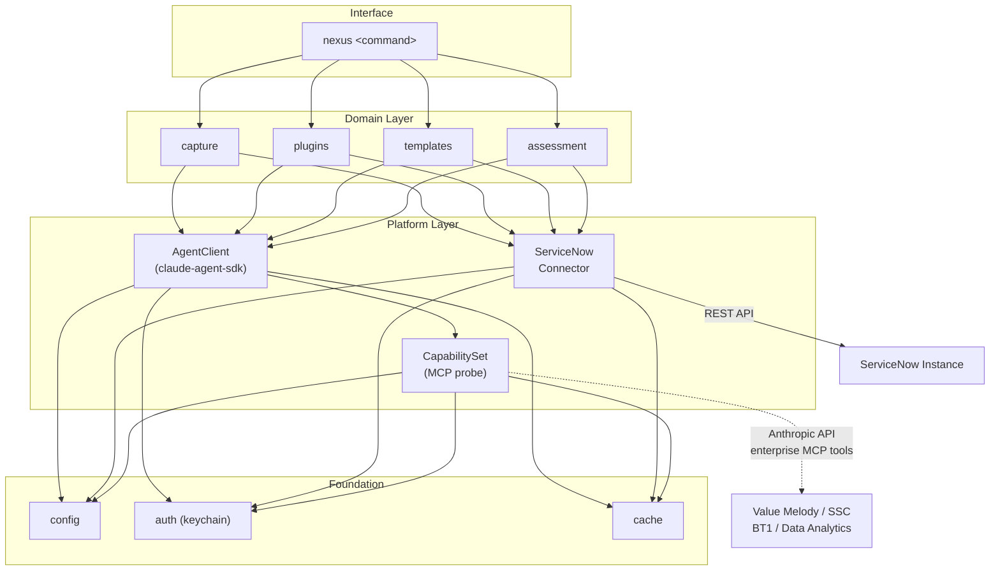
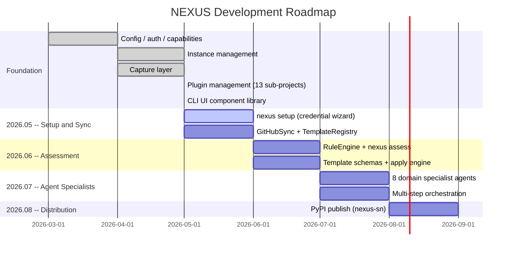
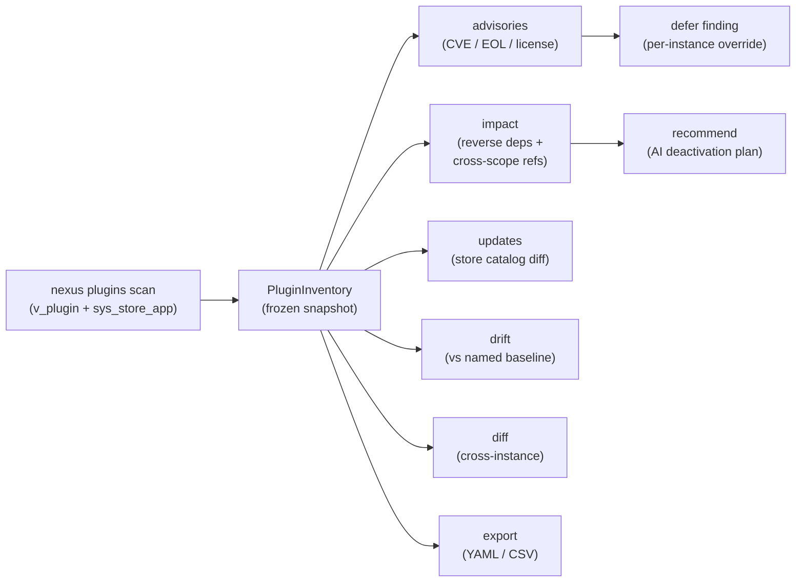

# NEXUS

ServiceNow AI architect agent -- standalone CLI and optional web dashboard.

Uses the Anthropic API directly. No Claude Code or Claude Desktop required.
Runs on Windows, macOS, and Linux.

## Architecture



## Install

```bash
pip install nexus-sn          # CLI only
pip install nexus-sn[ui]      # CLI + NiceGUI dashboard
```

## Quick start

```bash
nexus instance register       # add a ServiceNow instance (auto-provisions OAuth)
nexus status                  # verify connection and capability tier
nexus capture discover        # scan AI automation artifacts in your instance
nexus capture pull <scope>    # download scope configuration to local YAML
nexus plugins scan            # inventory all installed plugins
nexus plugins advisories      # CVE, EOL, and license findings
nexus plugins impact <id>     # reverse-dependency and record-count analysis
```

## Roadmap



## What is implemented

<!-- tests -->832 tests passing, all real fakes, no mocks.<!-- /tests -->

The following commands are fully functional:

- `nexus status` -- tier detection, MCP capability probe, auto-update check
- `nexus instance` -- register, connect, refresh, list, delete, use
- `nexus capture` -- discover, pull, list, push (bidirectional SN config transport)
- `nexus plugins` -- scan, list, info, inventory, impact, advisories, orphans,
  diff, updates, drift, baselines, recommend, export
- `nexus reauth` -- OAuth token refresh helper
- `nexus update` -- manual update check

The following commands are stubs (not yet implemented):

- `nexus setup` -- credential wizard (2026.05)
- `nexus sync` -- pull latest templates from GitHub (2026.05)
- `nexus templates` -- browse and apply templates (2026.05)
- `nexus assess` -- instance health scan (2026.06)

## Plugin management

The `nexus plugins` subapp covers the full lifecycle of ServiceNow application plugins:



```bash
nexus plugins scan                        # full inventory (v_plugin + sys_store_app)
nexus plugins list --source store         # filter by source
nexus plugins advisories --strict         # exit 1 if findings found
nexus plugins impact <plugin-id>          # impact analysis with cross-scope refs
nexus plugins drift --baseline prod       # compare against a named baseline
nexus plugins diff <instance-a> <instance-b>  # cross-instance comparison
nexus plugins recommend deactivate <id>   # AI-generated deactivation plan
nexus plugins export --format csv         # export inventory to CSV
```

## Requirements

- Python 3.14+
- ServiceNow instance with REST API access
- Claude Enterprise API key (Anthropic)

## Contributing templates

See `docs/CONTRIBUTING.md`.

## Version

CalVer: 2026.05.1

## License

MIT
