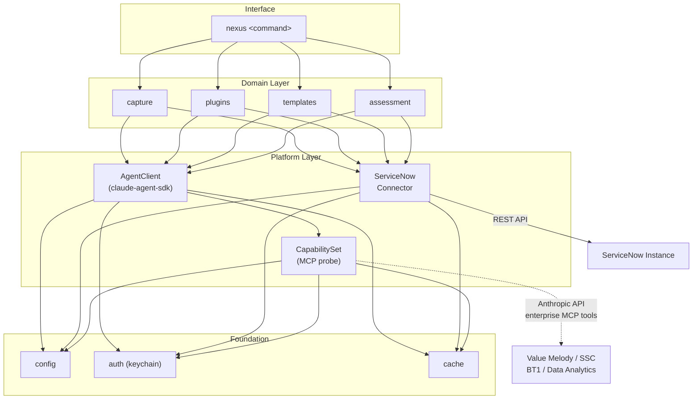
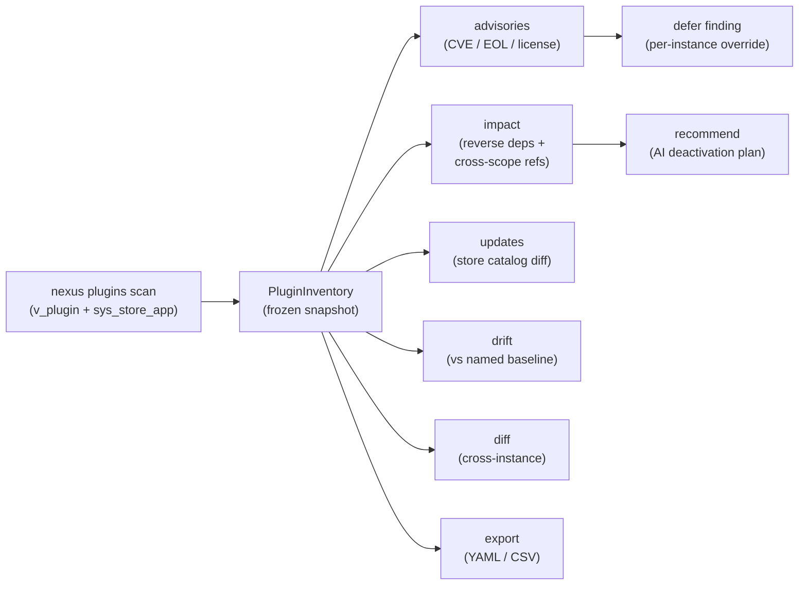

# NEXUS

ServiceNow AI architect agent -- standalone CLI and optional web dashboard.

Uses the Claude Agent SDK. Runs on Windows, macOS, and Linux.

## Architecture



## Install

Not yet on PyPI. Install from the latest GitHub release wheel or from source.

**From the latest release wheel (recommended):**

```bash
pip install https://github.com/pierregrothe/nexus-sn/releases/download/2026.05.2/nexus_sn-2026.5.2-py3-none-any.whl
```

**From source:**

```bash
git clone https://github.com/pierregrothe/nexus-sn.git
cd nexus-sn
pip install .
```

**With the optional NiceGUI dashboard:**

```bash
pip install "nexus_sn-2026.5.2-py3-none-any.whl[ui]"   # wheel
# or
pip install ".[ui]"                                       # from source
```

## Quick start

```bash
nexus instance register       # add a ServiceNow instance (auto-provisions OAuth)
nexus status                  # verify connection and capability tier
nexus capture discover        # scan AI automation artifacts in your instance
nexus capture pull <scope>    # download scope configuration to local YAML
nexus plugins scan            # inventory all installed plugins
nexus plugins advisories      # CVE, EOL, and license findings
nexus plugins impact <id>     # reverse-dependency and record-count analysis
```

## Roadmap

<!-- gantt -->
```mermaid
gantt
    title NEXUS Development Roadmap
    dateFormat YYYY-MM
    section Foundation
        Config, auth, capabilities layers            :done, 2026-03, 2026-05
        ServiceNow REST connector + error hierarchy  :done, 2026-03, 2026-05
        ConnectorProtocol plugin system              :done, 2026-03, 2026-05
        Instance management                          :done, 2026-03, 2026-05
        CLI skeleton                                 :done, 2026-03, 2026-05
        CI/CD: lint, tests, release, template val... :done, 2026-03, 2026-05
        AgentClient backed by claude-agent-sdk       :done, 2026-03, 2026-05
        nexus status command                         :done, 2026-03, 2026-05
        nexus.capture layer                          :done, 2026-03, 2026-05
        nexus capture command                        :done, 2026-03, 2026-05
        nexus.plugins layer                          :done, 2026-03, 2026-05
        nexus plugins command                        :done, 2026-03, 2026-05
        Unified CLI UI library                       :done, 2026-03, 2026-05
    section Plugin Execution
        Sub-project M: Plugin execution core         :active, 2026-05, 2026-06
        Sub-project N: Destructive operations        :active, 2026-05, 2026-06
    section Setup + Sync
        nexus setup command                          :active, 2026-05, 2026-06
        GitHubSync                                   :active, 2026-05, 2026-06
        TemplateRegistry                             :active, 2026-05, 2026-06
    section Assessment
        RuleEngine + AssessmentReporter              2026-06, 2026-07
        nexus assess command                         2026-06, 2026-07
        Gate 1 readiness check + Gate 2 validatio... 2026-06, 2026-07
    section Template Library
        NowAssistSkill + Workflow Pydantic schemas   2026-06, 2026-07
        First 3+ community templates in templates/   2026-06, 2026-07
        Template apply engine                        2026-06, 2026-07
    section Agent Specialists
        8 domain specialist agents implemented       2026-07, 2026-08
        ExecutionContext enrichment from enterpri... 2026-07, 2026-08
        Multi-step orchestration via Planner + Di... 2026-07, 2026-08
        Rollback manager for failed deployments      2026-07, 2026-08
    section Distribution
        100% line coverage, mypy strict, ruff 0 v... 2026-08, 2026-09
        README + getting started documentation       2026-08, 2026-09
        PyPI publish                                 2026-08, 2026-09
```
<!-- /gantt -->

## What is implemented

<!-- tests -->825 tests passing, all real fakes, no mocks.<!-- /tests -->

The following commands are fully functional:

- `nexus status` -- tier detection, MCP capability probe, auto-update check
- `nexus instance` -- register, connect, refresh, list, delete, use
- `nexus capture` -- discover, pull, list, push (bidirectional SN config transport)
- `nexus plugins` -- scan, list, info, inventory, impact, advisories, orphans,
  diff, updates, drift, baselines, recommend, export
- `nexus reauth` -- OAuth token refresh helper
- `nexus update` -- manual update check

The following commands are stubs (not yet implemented):

- `nexus setup` -- credential wizard (2026.05)
- `nexus sync` -- pull latest templates from GitHub (2026.05)
- `nexus templates` -- browse and apply templates (2026.05)
- `nexus assess` -- instance health scan (2026.06)
- `nexus apply` -- deploy a template (2026.06)
- `nexus run` -- free-form AI orchestration (2026.07)
- `nexus rollback` -- undo a previous deployment (2026.07)

## Plugin management

The `nexus plugins` subapp covers the full lifecycle of ServiceNow application plugins:



```bash
nexus plugins scan                        # full inventory (v_plugin + sys_store_app)
nexus plugins list --source store         # filter by source
nexus plugins advisories --strict         # exit 1 if findings found
nexus plugins impact <plugin-id>          # impact analysis with cross-scope refs
nexus plugins drift --baseline prod       # compare against a named baseline
nexus plugins diff <instance-a> <instance-b>  # cross-instance comparison
nexus plugins recommend deactivate <id>   # AI-generated deactivation plan
nexus plugins export --format csv         # export inventory to CSV
```

## Requirements

- Python 3.14+
- ServiceNow instance with REST API access
- Claude Code installed and authenticated (OAuth credentials are read automatically),
  or `ANTHROPIC_API_KEY` env var set as a fallback for CI / scripted use

## Contributing templates

See `docs/CONTRIBUTING.md`.

## Version

CalVer: 2026.05.2

## License

MIT
