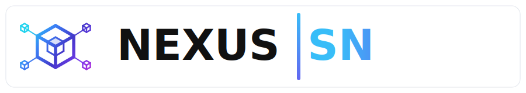
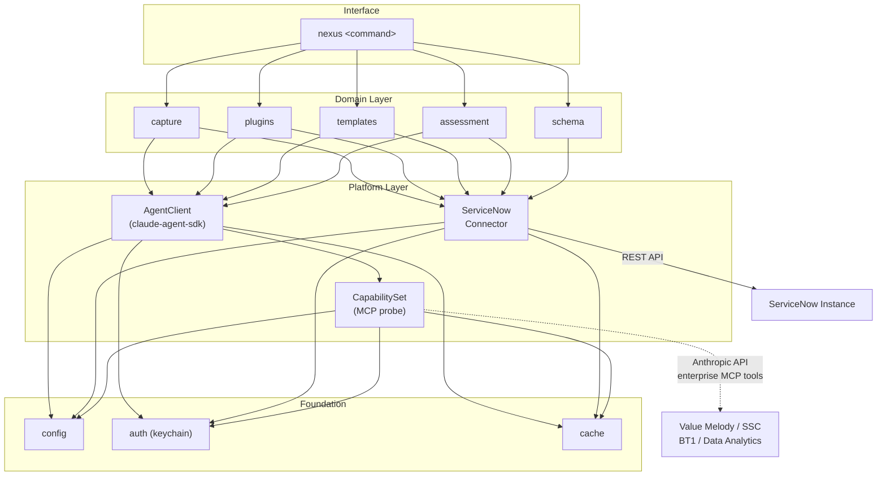
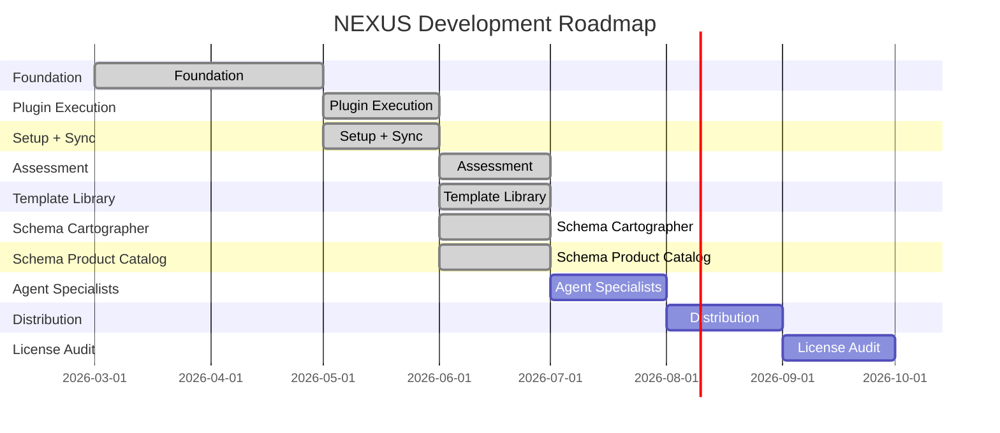
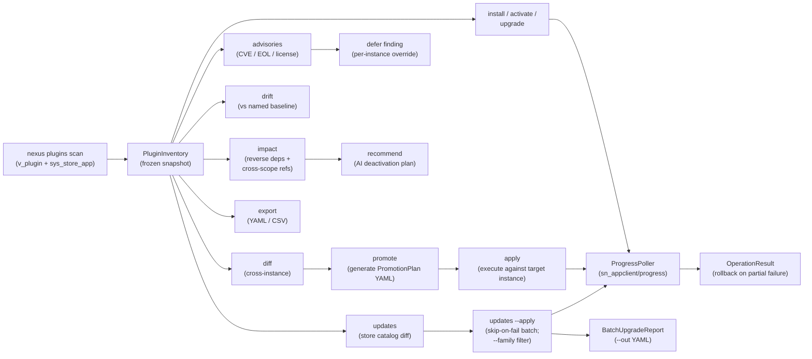

# NEXUS

<p align="center">
  
</p>

<!-- badges -->
[](https://github.com/pierregrothe/nexus-sn/releases)
[](https://github.com/pierregrothe/nexus-sn/actions/workflows/ci.yml)
[](LICENSE)
[](https://www.python.org/downloads/)
[](https://github.com/pierregrothe/nexus-sn/actions)
[](https://github.com/pierregrothe/nexus-sn/tree/main/src)
<!-- /badges -->

ServiceNow AI architect agent -- standalone CLI and optional web dashboard.

Uses the Claude Agent SDK. Runs on Windows, macOS, and Linux.

## Architecture



## Install

Not yet on PyPI. Install from the latest GitHub release wheel or from source.

**From the latest release wheel (recommended):**

```bash
pip install https://github.com/pierregrothe/nexus-sn/releases/download/2026.06.0/nexus_sn-2026.6.0-py3-none-any.whl
```

**From source:**

```bash
git clone https://github.com/pierregrothe/nexus-sn.git
cd nexus-sn
pip install .
```

**With the optional NiceGUI dashboard:**

```bash
pip install "nexus_sn-2026.5.2-py3-none-any.whl[ui]"   # wheel
# or
pip install ".[ui]"                                       # from source
```

## Quick start

```bash
nexus instance register       # add a ServiceNow instance (auto-provisions OAuth)
nexus status                  # verify connection and capability tier
nexus capture discover        # scan AI automation artifacts in your instance
nexus capture pull <scope>    # download scope configuration to local YAML
nexus plugins scan            # inventory all installed plugins
nexus plugins advisories      # CVE, EOL, and license findings
nexus plugins impact <id>     # reverse-dependency and record-count analysis
```

## Roadmap

<!-- gantt -->

<!-- /gantt -->

## What is implemented

<!-- tests -->1775 tests passing, all real fakes, no mocks.<!-- /tests -->

NEXUS picks one of four render profiles at startup -- **RICH**, **BASIC**,
**LEGACY**, **PLAIN** -- by inspecting the terminal once (TTY status, color
depth, terminal size, CI env vars, `$TERM`, `$WT_SESSION`, etc.). On a
modern terminal you get gradient panels and a scrollable pager for long
lists; in CI or under `--plain` you get tab-separated plain text. Run
`nexus status` to see the detected profile. Override with `--plain` or
`NEXUS_PLAIN=1`.

The following commands are fully functional:

- `nexus status` -- tier detection, MCP capability probe, auto-update check
- `nexus instance` -- register, connect, refresh, list, delete, use
- `nexus capture` -- discover, pull, list, push (bidirectional SN config transport)
- `nexus plugins` -- scan, list, info, impact, advisories, orphans, diff,
  updates, drift, baselines, recommend, export, promote, install, activate,
  upgrade, apply (full lifecycle including PromotionPlan execution against
  ServiceNow's discovered sn_appclient endpoints)
- `nexus schema` -- products, erd (reverse-engineer ServiceNow tables into
  Mermaid ERDs; product catalog synced from GitHub; accepts product name,
  acronym, or key; 1-2 products per ERD; deterministic, `--grouped` per-scope,
  SVG rendered by default via Kroki, offline archive round-trip)
- `nexus reauth` -- OAuth token refresh helper
- `nexus update` -- manual update check

The following commands are stubs (not yet implemented):

- `nexus setup` -- credential wizard (2026.05)
- `nexus sync` -- pull latest templates from GitHub (2026.05)
- `nexus templates` -- browse and apply templates (2026.05)
- `nexus assess` -- instance health scan (2026.06)
- `nexus apply` -- deploy a template (2026.06)
- `nexus run` -- free-form AI orchestration (2026.07)
- `nexus rollback` -- undo a previous deployment (2026.07)

## Plugin management

The `nexus plugins` subapp covers the full lifecycle of ServiceNow application plugins -- inventory and analysis on the read side, install / upgrade / apply on the write side:



Read-side commands (analysis):

```bash
nexus plugins scan                        # full inventory (v_plugin + sys_store_app)
nexus plugins list --source store         # filter by source
nexus plugins advisories --strict         # exit 1 if findings found
nexus plugins impact <plugin-id>          # impact analysis with cross-scope refs
nexus plugins drift --baseline prod       # compare against a named baseline
nexus plugins diff <instance-a> <instance-b>  # cross-instance comparison
nexus plugins recommend deactivate <id>   # AI-generated deactivation plan
nexus plugins export --format csv         # export inventory to CSV
```

Write-side commands (execution):

```bash
nexus plugins install <plugin-id>                # install with dependency-cascade preview
nexus plugins upgrade <plugin-id> --to X.Y.Z     # upgrade to a specific version
nexus plugins activate <plugin-id>               # activate an installed plugin
nexus plugins updates --apply --yes              # batch-upgrade every pending plugin (skip-on-fail)
nexus plugins updates --apply --yes --family ITSM --family ITOM  # filter the batch to one or more families
nexus plugins updates --apply --yes --out report.yaml            # write a BatchUpgradeReport YAML
nexus plugins promote dev --to prod --out plan.yaml  # generate PromotionPlan
nexus plugins apply plan.yaml                    # execute the plan; rolls back on partial failure
```

Note: `nexus plugins deactivate` and `nexus plugins uninstall` exist as
forward-compatible stubs but fail loudly on live ServiceNow. ServiceNow does
not expose deactivation or uninstall via any programmatic API on Yokohama --
the `AppsAjaxProcessor` is flagged "not public" and only the SN UI can
invoke it. Use the ServiceNow Application Manager UI for those operations.

## Schema cartography

`nexus schema` reverse-engineers a live ServiceNow data dictionary into
Mermaid entity-relationship diagrams. Each entity box carries the table's key
fields (primary key, business columns, foreign-key references); edges are
derived deterministically from `sys_dictionary` reference columns and
`sys_relationship` rows. No LLM is involved, so the output is byte-stable
across runs.

```bash
nexus schema products                       # list available products and scopes
nexus schema erd HAM                        # HAM -> ITSM bridge ERD (SVG by default)
nexus schema erd "Document Designer"        # resolve by full name
nexus schema erd DOC                        # resolve by acronym
nexus schema erd bcm itsm                   # combine two products into one ERD
nexus schema erd bcm --grouped              # one diagram per scope
nexus schema erd bcm --image png            # render PNG instead of SVG
nexus schema erd bcm --save-archive         # persist the discovered graph as JSON
nexus schema erd bcm --from-archive bcm.json  # re-render offline
```

Four products ship out of the box: `ham` (Hardware Asset Management),
`itsm` (IT Service Management bridge targets), `doc-designer` (Document
Designer), and `bcm` (Business Continuity Management). The catalog is bundled
in the package and updated via `nexus sync`. SVG is rendered by default using
[Kroki](https://kroki.io) -- point `--kroki-url` at a self-hosted instance for
air-gapped environments. See `docs/schema-image-export.md`.

## Requirements

- Python 3.14+
- ServiceNow instance with REST API access
- Claude Code installed and authenticated (OAuth credentials are read automatically),
  or `ANTHROPIC_API_KEY` env var set as a fallback for CI / scripted use

## Contributing templates

See `docs/CONTRIBUTING.md`.

## Version

CalVer: 2026.06.0

## License

NEXUS Source License v1.0 (Apache 2.0 + Commons Clause).
Free for personal, internal, demo, POC, and production use on your own instances.
Commercial use -- consulting, partner billing, managed services -- is prohibited.
See [LICENSE](LICENSE) and [NOTICE](NOTICE) for full terms.
