# Schema ERD: bcm

Instance: `alectri`  |  scopes: sn_bcm, sn_bcm_lite, sn_bcm_map, sn_bcp
Discovered: 2026-06-11T14:56:43.853981+00:00

```mermaid
erDiagram
    sn_bcm_choice {
        GUID sys_id PK
        boolean active
        string choice_category
        translated_text label
        string name
    }
    sn_bcm_dependency_snapshot {
        GUID sys_id PK
        glide_date_time last_synced_on
        string notification_status
        string number
        string state
        reference config_used FK
        glide_list user_list FK
    }
    sn_bcm_dependency_update {
        GUID sys_id PK
        json additional_data
        document_id asset_id
        table_name asset_table
        document_id parent_id
        table_name parent_table
        document_id relationship_source
        table_name relationship_source_table
        string source
        string state
        reference snapshot FK
    }
    sn_bcm_dependency_update_config {
        GUID sys_id PK
        boolean active
        boolean auto_update_dependencies
        conditions condition
        string name
        integer order
        boolean send_notification
        string source_records
        table_name table
        template_value template
        field_list user_fields
        glide_list sources FK
    }
    sn_bcm_document {
        GUID sys_id PK
        translated_html default_text
        string description
        string name
        string title
    }
    sn_bcm_element_definition {
        GUID sys_id PK
        string description
        conditions filter
        translated_text name
        string requires_data_backup
        table_name source_table
        field_list source_table_fields
        reference resource_configuration FK
    }
    sn_bcm_element_variable {
        GUID sys_id PK
        boolean enable_reporting
        reference model FK
    }
    sn_bcm_grid_category {
        GUID sys_id PK
        string code
        boolean enable_element_context
        string name
    }
    sn_bcm_grid_column_configuration {
        GUID sys_id PK
        boolean enable_filter
        boolean enable_group
        boolean enable_sort
        field_name field
        string field_source
        integer order
        table_name source_table
        reference grid_configuration FK
    }
    sn_bcm_grid_configuration {
        GUID sys_id PK
        boolean active
        string name
        reference element_definition FK
        reference grid_category FK
    }
    sn_bcm_impact_analysis_question {
        GUID sys_id PK
        string description
        integer order
        string question
        reference impact_category FK
    }
    sn_bcm_impact_category {
        GUID sys_id PK
        string contributes_to
        string description
        string helper_text
        string name
        glide_list applicable_timeframes FK
        reference max_rto_value FK
    }
    sn_bcm_impact_rating {
        GUID sys_id PK
        string description
        string name
        string question_text
        boolean tolerable
        integer value
        reference impact_analysis_question FK
        reference impact_category FK
    }
    sn_bcm_loss_scenario {
        GUID sys_id PK
        string description
        string scenario_name
        reference elements_impacted FK
    }
    sn_bcm_phase {
        GUID sys_id PK
        boolean active
        string name
        integer order
    }
    sn_bcm_progress_tracker {
        GUID sys_id PK
    }
    sn_bcm_recovery_tier {
        GUID sys_id PK
        string name
        glide_list recovery_time_objectives FK
    }
    sn_bcm_timeframe {
        GUID sys_id PK
        string name
        glide_duration starts_at
    }
    sn_bcm_unique_user_usage {
        GUID sys_id PK
        string accrual_period
        reference user FK
    }
    sn_bcp_approval {
        GUID sys_id PK
        reference plan FK
    }
    sn_bcp_dependency_snapshot {
        GUID sys_id PK
        reference plan FK
    }
    sn_bcp_dependency_update {
        GUID sys_id PK
        reference impact_analysis FK
    }
    sn_bcp_dependency_update_config {
        GUID sys_id PK
    }
    sn_bcp_document {
        GUID sys_id PK
        html contents
        string description
        integer order
        string status
        string title
        reference plan FK
        reference template FK
    }
    sn_bcp_m2m_plan_asset_plan_asset {
        GUID sys_id PK
        document_id relationship_source
        table_name relationship_source_table
        string source
        reference dependency FK
        reference primary_asset FK
        reference related_asset FK
    }
    sn_bcp_plan {
        GUID sys_id PK
        boolean actions_blocked
        glide_date_time actions_blocked_on
        journal_input comments
        string description
        glide_date expires
        string name
        boolean refresh_task_order
        string state
        integer tasks_count
        string type
        file_attachment word_report
        reference bcm_lead FK
        reference business_unit FK
        glide_list contributors FK
        reference department FK
        reference plan_owner FK
        reference template FK
    }
    sn_bcp_plan_asset {
        GUID sys_id PK
        document_id item
        table_name item_table
        string name
        glide_duration recovery_time_objective_gap
        string status_in_source
        glide_date_time synchronized_on
        string type
        glide_list types
        reference element_definition FK
        reference impact_analysis FK
        reference plan FK
        reference recovery_point_objective FK
        reference recovery_tier FK
        reference recovery_time_achievable FK
        reference recovery_time_objective FK
    }
    sn_bcp_plan_asset_dependency {
        GUID sys_id PK
        document_id item
        table_name item_table
        reference plan_loss_scenario FK
    }
    sn_bcp_plan_loss_scenario {
        GUID sys_id PK
        string name
        reference loss_scenario FK
        reference plan FK
    }
    sn_bcp_plan_plan {
        GUID sys_id PK
        string assets_in_plan
        boolean is_associated_to_task
        string relationship
        string source
        integer tasks
        reference plan FK
        reference related_plan FK
    }
    sn_bcp_plan_task {
        GUID sys_id PK
        reference plan FK
    }
    sn_bcp_recovery_strategy {
        GUID sys_id PK
        html comments
        string description
        string name
        percent_complete operations_achieved_percentage
        glide_list dependencies_covered FK
        reference duration_of_use FK
        reference plan_loss_scenario FK
        reference time_to_implement FK
    }
    sn_bcp_recovery_task {
        GUID sys_id PK
        string asset_recovery_level
        string description
        boolean exclude_calculation
        string include_task_in
        integer order
        glide_duration planned_duration
        string short_description
        string tag_assets
        string task_classification
        string task_group
        decimal task_id
        boolean use_external_dependency
        glide_list additional_assignees FK
        glide_list asset_scope FK
        reference assignment_group FK
        reference automated_flow FK
        reference completion_deadline FK
        reference configuration_item FK
        glide_list dependencies FK
        reference documentation FK
        glide_var flow_variables FK
        reference owner FK
        reference phase FK
        reference plan FK
        reference plan_dependency FK
        reference recovery_strategy FK
        reference recovery_team FK
        reference scope FK
        reference tag FK
    }
    sn_bcp_recovery_tasks_dependency_graph {
        GUID sys_id PK
        boolean active
        json dependency_graph
        reference plan FK
    }
    sn_bcp_recovery_team {
        GUID sys_id PK
        string description
        string name
        glide_list group FK
        reference plan FK
        glide_list user FK
    }
    sn_bcp_template {
        GUID sys_id PK
        string description
        field_name group_by
        boolean group_recovery_tasks
        string name
        string plan_authoring_type
        glide_list document_sections FK
        glide_list loss_scenarios FK
        reference primary_element_recovered FK
    }
    sn_bcm_dependency_snapshot }o--|| sn_bcm_dependency_update_config : "config_used"
    sn_bcm_dependency_snapshot }o--o{ sys_user : "user_list"
    sn_bcm_dependency_update }o--|| sn_bcm_dependency_snapshot : "snapshot"
    sn_bcm_dependency_update_config }o--o{ sn_grc_rel_config_main_node_config : "sources"
    sn_bcm_element_definition }o--|| sn_fam_resource_config : "resource_configuration"
    sn_bcm_element_variable }o--|| sn_bcm_element_definition : "model"
    sn_bcm_grid_column_configuration }o--|| sn_bcm_grid_configuration : "grid_configuration"
    sn_bcm_grid_configuration }o--|| sn_bcm_element_definition : "element_definition"
    sn_bcm_grid_configuration }o--|| sn_bcm_grid_category : "grid_category"
    sn_bcm_impact_analysis_question }o--|| sn_bcm_impact_category : "impact_category"
    sn_bcm_impact_category }o--o{ sn_bcm_timeframe : "applicable_timeframes"
    sn_bcm_impact_category }o--|| sn_bcm_timeframe : "max_rto_value"
    sn_bcm_impact_rating }o--|| sn_bcm_impact_analysis_question : "impact_analysis_question"
    sn_bcm_impact_rating }o--|| sn_bcm_impact_category : "impact_category"
    sn_bcm_loss_scenario }o--|| sn_bcm_element_definition : "elements_impacted"
    sn_bcm_recovery_tier }o--o{ sn_bcm_timeframe : "recovery_time_objectives"
    sn_bcm_unique_user_usage }o--|| sys_user : "user"
    sn_bcp_approval }o--|| sn_bcp_plan : "plan"
    sn_bcp_dependency_snapshot }o--|| sn_bcp_plan : "plan"
    sn_bcp_dependency_update }o--|| sn_bia_analysis : "impact_analysis"
    sn_bcp_document }o--|| sn_bcp_plan : "plan"
    sn_bcp_document }o--|| sn_bcm_document : "template"
    sn_bcp_m2m_plan_asset_plan_asset }o--|| sn_bia_dependency : "dependency"
    sn_bcp_m2m_plan_asset_plan_asset }o--|| sn_bcp_plan_asset : "primary_asset"
    sn_bcp_m2m_plan_asset_plan_asset }o--|| sn_bcp_plan_asset : "related_asset"
    sn_bcp_plan }o--|| sys_user : "bcm_lead"
    sn_bcp_plan }o--|| business_unit : "business_unit"
    sn_bcp_plan }o--o{ sys_user : "contributors"
    sn_bcp_plan }o--|| cmn_department : "department"
    sn_bcp_plan }o--|| sys_user : "plan_owner"
    sn_bcp_plan }o--|| sn_bcp_template : "template"
    sn_bcp_plan_asset }o--|| sn_bcm_element_definition : "element_definition"
    sn_bcp_plan_asset }o--|| sn_bia_analysis : "impact_analysis"
    sn_bcp_plan_asset }o--|| sn_bcp_plan : "plan"
    sn_bcp_plan_asset }o--|| sn_bcm_timeframe : "recovery_point_objective"
    sn_bcp_plan_asset }o--|| sn_bcm_recovery_tier : "recovery_tier"
    sn_bcp_plan_asset }o--|| sn_bcm_timeframe : "recovery_time_achievable"
    sn_bcp_plan_asset }o--|| sn_bcm_timeframe : "recovery_time_objective"
    sn_bcp_plan_asset_dependency }o--|| sn_bcp_plan_loss_scenario : "plan_loss_scenario"
    sn_bcp_plan_loss_scenario }o--|| sn_bcm_loss_scenario : "loss_scenario"
    sn_bcp_plan_loss_scenario }o--|| sn_bcp_plan : "plan"
    sn_bcp_plan_plan }o--|| sn_bcp_plan : "plan"
    sn_bcp_plan_plan }o--|| sn_bcp_plan : "related_plan"
    sn_bcp_plan_task }o--|| sn_bcp_plan : "plan"
    sn_bcp_recovery_strategy }o--o{ sn_bcp_plan_asset_dependency : "dependencies_covered"
    sn_bcp_recovery_strategy }o--|| sn_bcm_timeframe : "duration_of_use"
    sn_bcp_recovery_strategy }o--|| sn_bcp_plan_loss_scenario : "plan_loss_scenario"
    sn_bcp_recovery_strategy }o--|| sn_bcm_timeframe : "time_to_implement"
    sn_bcp_recovery_task }o--o{ sys_user : "additional_assignees"
    sn_bcp_recovery_task }o--o{ sn_bcp_plan_asset : "asset_scope"
    sn_bcp_recovery_task }o--|| sys_user_group : "assignment_group"
    sn_bcp_recovery_task }o--|| sys_hub_flow : "automated_flow"
    sn_bcp_recovery_task }o--|| sn_bcm_timeframe : "completion_deadline"
    sn_bcp_recovery_task }o--|| cmdb_ci : "configuration_item"
    sn_bcp_recovery_task }o--o{ sn_bcp_recovery_task : "dependencies"
    sn_bcp_recovery_task }o--|| sn_bcp_document : "documentation"
    sn_bcp_recovery_task }o--|| sys_hub_flow_input : "flow_variables"
    sn_bcp_recovery_task }o--|| sys_user : "owner"
    sn_bcp_recovery_task }o--|| sn_bcm_phase : "phase"
    sn_bcp_recovery_task }o--|| sn_bcp_plan : "plan"
    sn_bcp_recovery_task }o--|| sn_bcp_plan : "plan_dependency"
    sn_bcp_recovery_task }o--|| sn_bcp_recovery_strategy : "recovery_strategy"
    sn_bcp_recovery_task }o--|| sn_bcp_recovery_team : "recovery_team"
    sn_bcp_recovery_task }o--|| sn_bcp_plan_asset : "scope"
    sn_bcp_recovery_task }o--|| sn_bcm_choice : "tag"
    sn_bcp_recovery_tasks_dependency_graph }o--|| sn_bcp_plan : "plan"
    sn_bcp_recovery_team }o--o{ sys_user_group : "group"
    sn_bcp_recovery_team }o--|| sn_bcp_plan : "plan"
    sn_bcp_recovery_team }o--o{ sys_user : "user"
    sn_bcp_template }o--o{ sn_bcm_document : "document_sections"
    sn_bcp_template }o--o{ sn_bcm_loss_scenario : "loss_scenarios"
    sn_bcp_template }o--|| sn_bcm_element_definition : "primary_element_recovered"
    sn_bcm_dependency_snapshot ||--|| sn_bcp_dependency_snapshot : "extends"
    sys_metadata ||--|| sn_bcm_timeframe : "extends"
    sys_metadata ||--|| sn_bcm_impact_rating : "extends"
    sys_metadata ||--|| sn_bcm_dependency_update_config : "extends"
    sys_metadata ||--|| sn_bcm_element_definition : "extends"
    sn_bcm_dependency_update_config ||--|| sn_bcp_dependency_update_config : "extends"
    sys_metadata ||--|| sn_bcm_loss_scenario : "extends"
    sn_grc_appr_approval ||--|| sn_bcp_approval : "extends"
    sn_bcm_dependency_update ||--|| sn_bcp_dependency_update : "extends"
    sys_metadata ||--|| sn_bcm_document : "extends"
    sn_irm_shared_cmn_progress_tracker ||--|| sn_bcm_progress_tracker : "extends"
    var_dictionary ||--|| sn_bcm_element_variable : "extends"
    sys_metadata ||--|| sn_bcm_recovery_tier : "extends"
    sys_metadata ||--|| sn_bcm_impact_analysis_question : "extends"
    sys_metadata ||--|| sn_bcp_template : "extends"
    task ||--|| sn_bcp_plan_task : "extends"
    sys_metadata ||--|| sn_bcm_impact_category : "extends"
```

## Cross-scope bridges

- sn_bcm_dependency_snapshot.user_list -> sys_user
- sn_bcm_dependency_update_config.sources -> sn_grc_rel_config_main_node_config
- sn_bcm_element_definition.resource_configuration -> sn_fam_resource_config
- sn_bcm_unique_user_usage.user -> sys_user
- sn_bcp_dependency_update.impact_analysis -> sn_bia_analysis
- sn_bcp_document.template -> sn_bcm_document
- sn_bcp_m2m_plan_asset_plan_asset.dependency -> sn_bia_dependency
- sn_bcp_plan.bcm_lead -> sys_user
- sn_bcp_plan.business_unit -> business_unit
- sn_bcp_plan.contributors -> sys_user
- sn_bcp_plan.department -> cmn_department
- sn_bcp_plan.plan_owner -> sys_user
- sn_bcp_plan_asset.element_definition -> sn_bcm_element_definition
- sn_bcp_plan_asset.impact_analysis -> sn_bia_analysis
- sn_bcp_plan_asset.recovery_point_objective -> sn_bcm_timeframe
- sn_bcp_plan_asset.recovery_tier -> sn_bcm_recovery_tier
- sn_bcp_plan_asset.recovery_time_achievable -> sn_bcm_timeframe
- sn_bcp_plan_asset.recovery_time_objective -> sn_bcm_timeframe
- sn_bcp_plan_loss_scenario.loss_scenario -> sn_bcm_loss_scenario
- sn_bcp_recovery_strategy.duration_of_use -> sn_bcm_timeframe
- sn_bcp_recovery_strategy.time_to_implement -> sn_bcm_timeframe
- sn_bcp_recovery_task.additional_assignees -> sys_user
- sn_bcp_recovery_task.assignment_group -> sys_user_group
- sn_bcp_recovery_task.automated_flow -> sys_hub_flow
- sn_bcp_recovery_task.completion_deadline -> sn_bcm_timeframe
- sn_bcp_recovery_task.configuration_item -> cmdb_ci
- sn_bcp_recovery_task.flow_variables -> sys_hub_flow_input
- sn_bcp_recovery_task.owner -> sys_user
- sn_bcp_recovery_task.phase -> sn_bcm_phase
- sn_bcp_recovery_task.tag -> sn_bcm_choice
- sn_bcp_recovery_team.group -> sys_user_group
- sn_bcp_recovery_team.user -> sys_user
- sn_bcp_template.document_sections -> sn_bcm_document
- sn_bcp_template.loss_scenarios -> sn_bcm_loss_scenario
- sn_bcp_template.primary_element_recovered -> sn_bcm_element_definition

## Fields

### sn_bcm_choice -- BCM Choice

| Field | Type | References |
| --- | --- | --- |
| active | boolean |  |
| choice_category | string |  |
| label | translated_text |  |
| name | string |  |
| sys_created_by | string |  |
| sys_created_on | glide_date_time |  |
| sys_domain | domain_id |  |
| sys_domain_path | domain_path |  |
| sys_id | GUID |  |
| sys_mod_count | integer |  |
| sys_updated_by | string |  |
| sys_updated_on | glide_date_time |  |

### sn_bcm_dependency_snapshot -- Dependency delta snapshot

| Field | Type | References |
| --- | --- | --- |
| config_used | reference | sn_bcm_dependency_update_config |
| last_synced_on | glide_date_time |  |
| notification_status | string |  |
| number | string |  |
| state | string |  |
| sys_class_name | sys_class_name |  |
| sys_created_by | string |  |
| sys_created_on | glide_date_time |  |
| sys_domain | domain_id |  |
| sys_domain_path | domain_path |  |
| sys_id | GUID |  |
| sys_mod_count | integer |  |
| sys_updated_by | string |  |
| sys_updated_on | glide_date_time |  |
| user_list | glide_list | sys_user |

### sn_bcm_dependency_update -- Dependency update

| Field | Type | References |
| --- | --- | --- |
| additional_data | json |  |
| asset_id | document_id |  |
| asset_table | table_name |  |
| parent_id | document_id |  |
| parent_table | table_name |  |
| relationship_source | document_id |  |
| relationship_source_table | table_name |  |
| snapshot | reference | sn_bcm_dependency_snapshot |
| source | string |  |
| state | string |  |
| sys_created_by | string |  |
| sys_created_on | glide_date_time |  |
| sys_domain | domain_id |  |
| sys_domain_path | domain_path |  |
| sys_id | GUID |  |
| sys_mod_count | integer |  |
| sys_updated_by | string |  |
| sys_updated_on | glide_date_time |  |

### sn_bcm_dependency_update_config -- Dependency update configuration

| Field | Type | References |
| --- | --- | --- |
| active | boolean |  |
| auto_update_dependencies | boolean |  |
| condition | conditions |  |
| name | string |  |
| order | integer |  |
| send_notification | boolean |  |
| source_records | string |  |
| sources | glide_list | sn_grc_rel_config_main_node_config |
| sys_domain | domain_id |  |
| sys_domain_path | domain_path |  |
| sys_id | GUID |  |
| table | table_name |  |
| template | template_value |  |
| user_fields | field_list |  |

### sn_bcm_document -- Documentation Section

| Field | Type | References |
| --- | --- | --- |
| default_text | translated_html |  |
| description | string |  |
| name | string |  |
| sys_domain | domain_id |  |
| sys_domain_path | domain_path |  |
| sys_id | GUID |  |
| title | string |  |

### sn_bcm_element_definition -- Element Definition

| Field | Type | References |
| --- | --- | --- |
| description | string |  |
| filter | conditions |  |
| name | translated_text |  |
| requires_data_backup | string |  |
| resource_configuration | reference | sn_fam_resource_config |
| source_table | table_name |  |
| source_table_fields | field_list |  |
| sys_domain | domain_id |  |
| sys_domain_path | domain_path |  |
| sys_id | GUID |  |

### sn_bcm_element_variable -- Element variable

| Field | Type | References |
| --- | --- | --- |
| enable_reporting | boolean |  |
| model | reference | sn_bcm_element_definition |
| sys_domain | domain_id |  |
| sys_domain_path | domain_path |  |
| sys_id | GUID |  |

### sn_bcm_grid_category -- Grid category

| Field | Type | References |
| --- | --- | --- |
| code | string |  |
| enable_element_context | boolean |  |
| name | string |  |
| sys_created_by | string |  |
| sys_created_on | glide_date_time |  |
| sys_domain | domain_id |  |
| sys_domain_path | domain_path |  |
| sys_id | GUID |  |
| sys_mod_count | integer |  |
| sys_updated_by | string |  |
| sys_updated_on | glide_date_time |  |

### sn_bcm_grid_column_configuration -- Grid column configuration

| Field | Type | References |
| --- | --- | --- |
| enable_filter | boolean |  |
| enable_group | boolean |  |
| enable_sort | boolean |  |
| field | field_name |  |
| field_source | string |  |
| grid_configuration | reference | sn_bcm_grid_configuration |
| order | integer |  |
| source_table | table_name |  |
| sys_created_by | string |  |
| sys_created_on | glide_date_time |  |
| sys_domain | domain_id |  |
| sys_domain_path | domain_path |  |
| sys_id | GUID |  |
| sys_mod_count | integer |  |
| sys_updated_by | string |  |
| sys_updated_on | glide_date_time |  |

### sn_bcm_grid_configuration -- Grid configuration

| Field | Type | References |
| --- | --- | --- |
| active | boolean |  |
| element_definition | reference | sn_bcm_element_definition |
| grid_category | reference | sn_bcm_grid_category |
| name | string |  |
| sys_created_by | string |  |
| sys_created_on | glide_date_time |  |
| sys_domain | domain_id |  |
| sys_domain_path | domain_path |  |
| sys_id | GUID |  |
| sys_mod_count | integer |  |
| sys_updated_by | string |  |
| sys_updated_on | glide_date_time |  |

### sn_bcm_impact_analysis_question -- Impact analysis question

| Field | Type | References |
| --- | --- | --- |
| description | string |  |
| impact_category | reference | sn_bcm_impact_category |
| order | integer |  |
| question | string |  |
| sys_domain | domain_id |  |
| sys_domain_path | domain_path |  |
| sys_id | GUID |  |

### sn_bcm_impact_category -- Impact Category

| Field | Type | References |
| --- | --- | --- |
| applicable_timeframes | glide_list | sn_bcm_timeframe |
| contributes_to | string |  |
| description | string |  |
| helper_text | string |  |
| max_rto_value | reference | sn_bcm_timeframe |
| name | string |  |
| sys_domain | domain_id |  |
| sys_domain_path | domain_path |  |
| sys_id | GUID |  |

### sn_bcm_impact_rating -- Impact Rating

| Field | Type | References |
| --- | --- | --- |
| description | string |  |
| impact_analysis_question | reference | sn_bcm_impact_analysis_question |
| impact_category | reference | sn_bcm_impact_category |
| name | string |  |
| question_text | string |  |
| sys_domain | domain_id |  |
| sys_domain_path | domain_path |  |
| sys_id | GUID |  |
| tolerable | boolean |  |
| value | integer |  |

### sn_bcm_loss_scenario -- Loss Scenario

| Field | Type | References |
| --- | --- | --- |
| description | string |  |
| elements_impacted | reference | sn_bcm_element_definition |
| scenario_name | string |  |
| sys_domain | domain_id |  |
| sys_domain_path | domain_path |  |
| sys_id | GUID |  |

### sn_bcm_phase -- Phase

| Field | Type | References |
| --- | --- | --- |
| active | boolean |  |
| name | string |  |
| order | integer |  |
| sys_created_by | string |  |
| sys_created_on | glide_date_time |  |
| sys_domain | domain_id |  |
| sys_domain_path | domain_path |  |
| sys_id | GUID |  |
| sys_mod_count | integer |  |
| sys_updated_by | string |  |
| sys_updated_on | glide_date_time |  |

### sn_bcm_progress_tracker -- Progress tracker

| Field | Type | References |
| --- | --- | --- |
| sys_id | GUID |  |

### sn_bcm_recovery_tier -- Recovery Tier

| Field | Type | References |
| --- | --- | --- |
| name | string |  |
| recovery_time_objectives | glide_list | sn_bcm_timeframe |
| sys_domain | domain_id |  |
| sys_domain_path | domain_path |  |
| sys_id | GUID |  |

### sn_bcm_timeframe -- Recovery Timeframe

| Field | Type | References |
| --- | --- | --- |
| name | string |  |
| starts_at | glide_duration |  |
| sys_domain | domain_id |  |
| sys_domain_path | domain_path |  |
| sys_id | GUID |  |

### sn_bcm_unique_user_usage -- Unique User Usage

| Field | Type | References |
| --- | --- | --- |
| accrual_period | string |  |
| sys_created_by | string |  |
| sys_created_on | glide_date_time |  |
| sys_domain | domain_id |  |
| sys_domain_path | domain_path |  |
| sys_id | GUID |  |
| sys_mod_count | integer |  |
| sys_updated_by | string |  |
| sys_updated_on | glide_date_time |  |
| user | reference | sys_user |

### sn_bcp_approval -- Approval levels

| Field | Type | References |
| --- | --- | --- |
| plan | reference | sn_bcp_plan |
| sys_id | GUID |  |

### sn_bcp_dependency_snapshot -- Plan dependency delta snapshot

| Field | Type | References |
| --- | --- | --- |
| plan | reference | sn_bcp_plan |
| sys_id | GUID |  |

### sn_bcp_dependency_update -- Plan dependency update

| Field | Type | References |
| --- | --- | --- |
| impact_analysis | reference | sn_bia_analysis |
| sys_id | GUID |  |

### sn_bcp_dependency_update_config -- Planning dependency update configuration

| Field | Type | References |
| --- | --- | --- |
| sys_id | GUID |  |

### sn_bcp_document -- Plan documentation

| Field | Type | References |
| --- | --- | --- |
| contents | html |  |
| description | string |  |
| order | integer |  |
| plan | reference | sn_bcp_plan |
| status | string |  |
| sys_created_by | string |  |
| sys_created_on | glide_date_time |  |
| sys_domain | domain_id |  |
| sys_domain_path | domain_path |  |
| sys_id | GUID |  |
| sys_mod_count | integer |  |
| sys_updated_by | string |  |
| sys_updated_on | glide_date_time |  |
| template | reference | sn_bcm_document |
| title | string |  |

### sn_bcp_m2m_plan_asset_plan_asset -- Plan asset relationship

| Field | Type | References |
| --- | --- | --- |
| dependency | reference | sn_bia_dependency |
| primary_asset | reference | sn_bcp_plan_asset |
| related_asset | reference | sn_bcp_plan_asset |
| relationship_source | document_id |  |
| relationship_source_table | table_name |  |
| source | string |  |
| sys_created_by | string |  |
| sys_created_on | glide_date_time |  |
| sys_domain | domain_id |  |
| sys_domain_path | domain_path |  |
| sys_id | GUID |  |
| sys_mod_count | integer |  |
| sys_updated_by | string |  |
| sys_updated_on | glide_date_time |  |

### sn_bcp_plan -- Plan

| Field | Type | References |
| --- | --- | --- |
| actions_blocked | boolean |  |
| actions_blocked_on | glide_date_time |  |
| bcm_lead | reference | sys_user |
| business_unit | reference | business_unit |
| comments | journal_input |  |
| contributors | glide_list | sys_user |
| department | reference | cmn_department |
| description | string |  |
| expires | glide_date |  |
| name | string |  |
| plan_owner | reference | sys_user |
| refresh_task_order | boolean |  |
| state | string |  |
| sys_created_by | string |  |
| sys_created_on | glide_date_time |  |
| sys_domain | domain_id |  |
| sys_domain_path | domain_path |  |
| sys_id | GUID |  |
| sys_mod_count | integer |  |
| sys_updated_by | string |  |
| sys_updated_on | glide_date_time |  |
| tasks_count | integer |  |
| template | reference | sn_bcp_template |
| type | string |  |
| word_report | file_attachment |  |

### sn_bcp_plan_asset -- Plan asset

| Field | Type | References |
| --- | --- | --- |
| element_definition | reference | sn_bcm_element_definition |
| impact_analysis | reference | sn_bia_analysis |
| item | document_id |  |
| item_table | table_name |  |
| name | string |  |
| plan | reference | sn_bcp_plan |
| recovery_point_objective | reference | sn_bcm_timeframe |
| recovery_tier | reference | sn_bcm_recovery_tier |
| recovery_time_achievable | reference | sn_bcm_timeframe |
| recovery_time_objective | reference | sn_bcm_timeframe |
| recovery_time_objective_gap | glide_duration |  |
| status_in_source | string |  |
| synchronized_on | glide_date_time |  |
| sys_created_by | string |  |
| sys_created_on | glide_date_time |  |
| sys_domain | domain_id |  |
| sys_domain_path | domain_path |  |
| sys_id | GUID |  |
| sys_mod_count | integer |  |
| sys_updated_by | string |  |
| sys_updated_on | glide_date_time |  |
| type | string |  |
| types | glide_list |  |

### sn_bcp_plan_asset_dependency -- Related asset dependency

| Field | Type | References |
| --- | --- | --- |
| item | document_id |  |
| item_table | table_name |  |
| plan_loss_scenario | reference | sn_bcp_plan_loss_scenario |
| sys_created_by | string |  |
| sys_created_on | glide_date_time |  |
| sys_domain | domain_id |  |
| sys_domain_path | domain_path |  |
| sys_id | GUID |  |
| sys_mod_count | integer |  |
| sys_updated_by | string |  |
| sys_updated_on | glide_date_time |  |

### sn_bcp_plan_loss_scenario -- Plan loss scenario

| Field | Type | References |
| --- | --- | --- |
| loss_scenario | reference | sn_bcm_loss_scenario |
| name | string |  |
| plan | reference | sn_bcp_plan |
| sys_created_by | string |  |
| sys_created_on | glide_date_time |  |
| sys_domain | domain_id |  |
| sys_domain_path | domain_path |  |
| sys_id | GUID |  |
| sys_mod_count | integer |  |
| sys_updated_by | string |  |
| sys_updated_on | glide_date_time |  |

### sn_bcp_plan_plan -- Related plan

| Field | Type | References |
| --- | --- | --- |
| assets_in_plan | string |  |
| is_associated_to_task | boolean |  |
| plan | reference | sn_bcp_plan |
| related_plan | reference | sn_bcp_plan |
| relationship | string |  |
| source | string |  |
| sys_created_by | string |  |
| sys_created_on | glide_date_time |  |
| sys_domain | domain_id |  |
| sys_domain_path | domain_path |  |
| sys_id | GUID |  |
| sys_mod_count | integer |  |
| sys_updated_by | string |  |
| sys_updated_on | glide_date_time |  |
| tasks | integer |  |

### sn_bcp_plan_task -- Plan task

| Field | Type | References |
| --- | --- | --- |
| plan | reference | sn_bcp_plan |
| sys_id | GUID |  |

### sn_bcp_recovery_strategy -- Recovery strategy

| Field | Type | References |
| --- | --- | --- |
| comments | html |  |
| dependencies_covered | glide_list | sn_bcp_plan_asset_dependency |
| description | string |  |
| duration_of_use | reference | sn_bcm_timeframe |
| name | string |  |
| operations_achieved_percentage | percent_complete |  |
| plan_loss_scenario | reference | sn_bcp_plan_loss_scenario |
| sys_created_by | string |  |
| sys_created_on | glide_date_time |  |
| sys_domain | domain_id |  |
| sys_domain_path | domain_path |  |
| sys_id | GUID |  |
| sys_mod_count | integer |  |
| sys_updated_by | string |  |
| sys_updated_on | glide_date_time |  |
| time_to_implement | reference | sn_bcm_timeframe |

### sn_bcp_recovery_task -- Recovery task

| Field | Type | References |
| --- | --- | --- |
| additional_assignees | glide_list | sys_user |
| asset_recovery_level | string |  |
| asset_scope | glide_list | sn_bcp_plan_asset |
| assignment_group | reference | sys_user_group |
| automated_flow | reference | sys_hub_flow |
| completion_deadline | reference | sn_bcm_timeframe |
| configuration_item | reference | cmdb_ci |
| dependencies | glide_list | sn_bcp_recovery_task |
| description | string |  |
| documentation | reference | sn_bcp_document |
| exclude_calculation | boolean |  |
| flow_variables | glide_var | sys_hub_flow_input |
| include_task_in | string |  |
| order | integer |  |
| owner | reference | sys_user |
| phase | reference | sn_bcm_phase |
| plan | reference | sn_bcp_plan |
| plan_dependency | reference | sn_bcp_plan |
| planned_duration | glide_duration |  |
| recovery_strategy | reference | sn_bcp_recovery_strategy |
| recovery_team | reference | sn_bcp_recovery_team |
| scope | reference | sn_bcp_plan_asset |
| short_description | string |  |
| sys_created_by | string |  |
| sys_created_on | glide_date_time |  |
| sys_domain | domain_id |  |
| sys_domain_path | domain_path |  |
| sys_id | GUID |  |
| sys_mod_count | integer |  |
| sys_updated_by | string |  |
| sys_updated_on | glide_date_time |  |
| tag | reference | sn_bcm_choice |
| tag_assets | string |  |
| task_classification | string |  |
| task_group | string |  |
| task_id | decimal |  |
| use_external_dependency | boolean |  |

### sn_bcp_recovery_tasks_dependency_graph -- Recovery tasks dependency graph

| Field | Type | References |
| --- | --- | --- |
| active | boolean |  |
| dependency_graph | json |  |
| plan | reference | sn_bcp_plan |
| sys_created_by | string |  |
| sys_created_on | glide_date_time |  |
| sys_domain | domain_id |  |
| sys_domain_path | domain_path |  |
| sys_id | GUID |  |
| sys_mod_count | integer |  |
| sys_updated_by | string |  |
| sys_updated_on | glide_date_time |  |

### sn_bcp_recovery_team -- Recovery team

| Field | Type | References |
| --- | --- | --- |
| description | string |  |
| group | glide_list | sys_user_group |
| name | string |  |
| plan | reference | sn_bcp_plan |
| sys_created_by | string |  |
| sys_created_on | glide_date_time |  |
| sys_domain | domain_id |  |
| sys_domain_path | domain_path |  |
| sys_id | GUID |  |
| sys_mod_count | integer |  |
| sys_updated_by | string |  |
| sys_updated_on | glide_date_time |  |
| user | glide_list | sys_user |

### sn_bcp_template -- Plan template

| Field | Type | References |
| --- | --- | --- |
| description | string |  |
| document_sections | glide_list | sn_bcm_document |
| group_by | field_name |  |
| group_recovery_tasks | boolean |  |
| loss_scenarios | glide_list | sn_bcm_loss_scenario |
| name | string |  |
| plan_authoring_type | string |  |
| primary_element_recovered | reference | sn_bcm_element_definition |
| sys_domain | domain_id |  |
| sys_domain_path | domain_path |  |
| sys_id | GUID |  |
