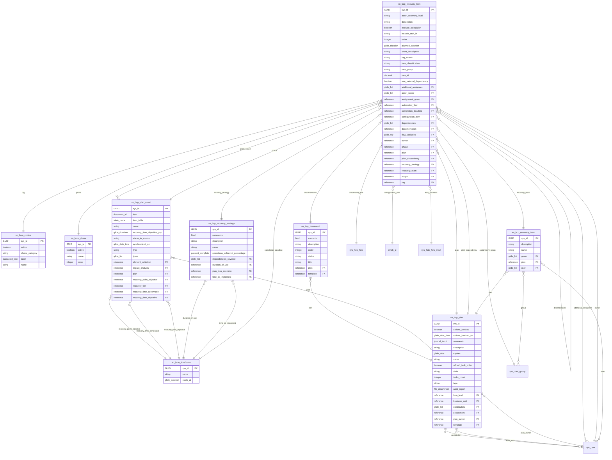

# Schema ERD: bcm-itsm

Instance: `alectri`  |  scopes: sn_bcm, sn_bcm_lite, sn_bcm_map, sn_bcp
Discovered: 2026-06-11T14:57:48.901373+00:00

## Cross-scope bridges

- sn_bcp_plan.bcm_lead -> sys_user
- sn_bcp_plan.contributors -> sys_user
- sn_bcp_plan.plan_owner -> sys_user
- sn_bcp_plan_asset.recovery_point_objective -> sn_bcm_timeframe
- sn_bcp_plan_asset.recovery_time_achievable -> sn_bcm_timeframe
- sn_bcp_plan_asset.recovery_time_objective -> sn_bcm_timeframe
- sn_bcp_recovery_strategy.duration_of_use -> sn_bcm_timeframe
- sn_bcp_recovery_strategy.time_to_implement -> sn_bcm_timeframe
- sn_bcp_recovery_task.additional_assignees -> sys_user
- sn_bcp_recovery_task.assignment_group -> sys_user_group
- sn_bcp_recovery_task.automated_flow -> sys_hub_flow
- sn_bcp_recovery_task.completion_deadline -> sn_bcm_timeframe
- sn_bcp_recovery_task.configuration_item -> cmdb_ci
- sn_bcp_recovery_task.flow_variables -> sys_hub_flow_input
- sn_bcp_recovery_task.owner -> sys_user
- sn_bcp_recovery_task.phase -> sn_bcm_phase
- sn_bcp_recovery_task.tag -> sn_bcm_choice
- sn_bcp_recovery_team.group -> sys_user_group
- sn_bcp_recovery_team.user -> sys_user

## Fields

### sn_bcm_choice -- BCM Choice

| Field | Type | References |
| --- | --- | --- |
| active | boolean |  |
| choice_category | string |  |
| label | translated_text |  |
| name | string |  |
| sys_created_by | string |  |
| sys_created_on | glide_date_time |  |
| sys_domain | domain_id |  |
| sys_domain_path | domain_path |  |
| sys_id | GUID |  |
| sys_mod_count | integer |  |
| sys_updated_by | string |  |
| sys_updated_on | glide_date_time |  |

### sn_bcm_phase -- Phase

| Field | Type | References |
| --- | --- | --- |
| active | boolean |  |
| name | string |  |
| order | integer |  |
| sys_created_by | string |  |
| sys_created_on | glide_date_time |  |
| sys_domain | domain_id |  |
| sys_domain_path | domain_path |  |
| sys_id | GUID |  |
| sys_mod_count | integer |  |
| sys_updated_by | string |  |
| sys_updated_on | glide_date_time |  |

### sn_bcm_timeframe -- Recovery Timeframe

| Field | Type | References |
| --- | --- | --- |
| name | string |  |
| starts_at | glide_duration |  |
| sys_domain | domain_id |  |
| sys_domain_path | domain_path |  |
| sys_id | GUID |  |

### sn_bcp_document -- Plan documentation

| Field | Type | References |
| --- | --- | --- |
| contents | html |  |
| description | string |  |
| order | integer |  |
| plan | reference | sn_bcp_plan |
| status | string |  |
| sys_created_by | string |  |
| sys_created_on | glide_date_time |  |
| sys_domain | domain_id |  |
| sys_domain_path | domain_path |  |
| sys_id | GUID |  |
| sys_mod_count | integer |  |
| sys_updated_by | string |  |
| sys_updated_on | glide_date_time |  |
| template | reference | sn_bcm_document |
| title | string |  |

### sn_bcp_plan -- Plan

| Field | Type | References |
| --- | --- | --- |
| actions_blocked | boolean |  |
| actions_blocked_on | glide_date_time |  |
| bcm_lead | reference | sys_user |
| business_unit | reference | business_unit |
| comments | journal_input |  |
| contributors | glide_list | sys_user |
| department | reference | cmn_department |
| description | string |  |
| expires | glide_date |  |
| name | string |  |
| plan_owner | reference | sys_user |
| refresh_task_order | boolean |  |
| state | string |  |
| sys_created_by | string |  |
| sys_created_on | glide_date_time |  |
| sys_domain | domain_id |  |
| sys_domain_path | domain_path |  |
| sys_id | GUID |  |
| sys_mod_count | integer |  |
| sys_updated_by | string |  |
| sys_updated_on | glide_date_time |  |
| tasks_count | integer |  |
| template | reference | sn_bcp_template |
| type | string |  |
| word_report | file_attachment |  |

### sn_bcp_plan_asset -- Plan asset

| Field | Type | References |
| --- | --- | --- |
| element_definition | reference | sn_bcm_element_definition |
| impact_analysis | reference | sn_bia_analysis |
| item | document_id |  |
| item_table | table_name |  |
| name | string |  |
| plan | reference | sn_bcp_plan |
| recovery_point_objective | reference | sn_bcm_timeframe |
| recovery_tier | reference | sn_bcm_recovery_tier |
| recovery_time_achievable | reference | sn_bcm_timeframe |
| recovery_time_objective | reference | sn_bcm_timeframe |
| recovery_time_objective_gap | glide_duration |  |
| status_in_source | string |  |
| synchronized_on | glide_date_time |  |
| sys_created_by | string |  |
| sys_created_on | glide_date_time |  |
| sys_domain | domain_id |  |
| sys_domain_path | domain_path |  |
| sys_id | GUID |  |
| sys_mod_count | integer |  |
| sys_updated_by | string |  |
| sys_updated_on | glide_date_time |  |
| type | string |  |
| types | glide_list |  |

### sn_bcp_recovery_strategy -- Recovery strategy

| Field | Type | References |
| --- | --- | --- |
| comments | html |  |
| dependencies_covered | glide_list | sn_bcp_plan_asset_dependency |
| description | string |  |
| duration_of_use | reference | sn_bcm_timeframe |
| name | string |  |
| operations_achieved_percentage | percent_complete |  |
| plan_loss_scenario | reference | sn_bcp_plan_loss_scenario |
| sys_created_by | string |  |
| sys_created_on | glide_date_time |  |
| sys_domain | domain_id |  |
| sys_domain_path | domain_path |  |
| sys_id | GUID |  |
| sys_mod_count | integer |  |
| sys_updated_by | string |  |
| sys_updated_on | glide_date_time |  |
| time_to_implement | reference | sn_bcm_timeframe |

### sn_bcp_recovery_task -- Recovery task

| Field | Type | References |
| --- | --- | --- |
| additional_assignees | glide_list | sys_user |
| asset_recovery_level | string |  |
| asset_scope | glide_list | sn_bcp_plan_asset |
| assignment_group | reference | sys_user_group |
| automated_flow | reference | sys_hub_flow |
| completion_deadline | reference | sn_bcm_timeframe |
| configuration_item | reference | cmdb_ci |
| dependencies | glide_list | sn_bcp_recovery_task |
| description | string |  |
| documentation | reference | sn_bcp_document |
| exclude_calculation | boolean |  |
| flow_variables | glide_var | sys_hub_flow_input |
| include_task_in | string |  |
| order | integer |  |
| owner | reference | sys_user |
| phase | reference | sn_bcm_phase |
| plan | reference | sn_bcp_plan |
| plan_dependency | reference | sn_bcp_plan |
| planned_duration | glide_duration |  |
| recovery_strategy | reference | sn_bcp_recovery_strategy |
| recovery_team | reference | sn_bcp_recovery_team |
| scope | reference | sn_bcp_plan_asset |
| short_description | string |  |
| sys_created_by | string |  |
| sys_created_on | glide_date_time |  |
| sys_domain | domain_id |  |
| sys_domain_path | domain_path |  |
| sys_id | GUID |  |
| sys_mod_count | integer |  |
| sys_updated_by | string |  |
| sys_updated_on | glide_date_time |  |
| tag | reference | sn_bcm_choice |
| tag_assets | string |  |
| task_classification | string |  |
| task_group | string |  |
| task_id | decimal |  |
| use_external_dependency | boolean |  |

### sn_bcp_recovery_team -- Recovery team

| Field | Type | References |
| --- | --- | --- |
| description | string |  |
| group | glide_list | sys_user_group |
| name | string |  |
| plan | reference | sn_bcp_plan |
| sys_created_by | string |  |
| sys_created_on | glide_date_time |  |
| sys_domain | domain_id |  |
| sys_domain_path | domain_path |  |
| sys_id | GUID |  |
| sys_mod_count | integer |  |
| sys_updated_by | string |  |
| sys_updated_on | glide_date_time |  |
| user | glide_list | sys_user |
