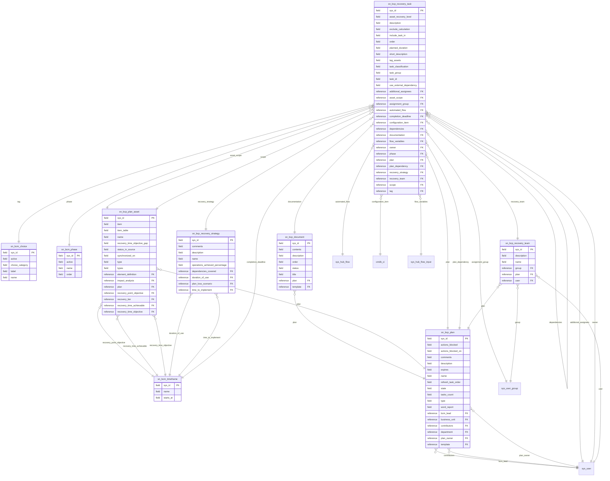

# Schema ERD: cmdb-bcm

Instance: `alectri`  |  scopes: sn_bcm, sn_bcp
Discovered: 2026-06-09T17:04:44.335142+00:00

## Cross-scope bridges

- sn_bcp_plan.bcm_lead -> sys_user
- sn_bcp_plan.contributors -> sys_user
- sn_bcp_plan.plan_owner -> sys_user
- sn_bcp_plan_asset.recovery_point_objective -> sn_bcm_timeframe
- sn_bcp_plan_asset.recovery_time_achievable -> sn_bcm_timeframe
- sn_bcp_plan_asset.recovery_time_objective -> sn_bcm_timeframe
- sn_bcp_recovery_strategy.duration_of_use -> sn_bcm_timeframe
- sn_bcp_recovery_strategy.time_to_implement -> sn_bcm_timeframe
- sn_bcp_recovery_task.additional_assignees -> sys_user
- sn_bcp_recovery_task.assignment_group -> sys_user_group
- sn_bcp_recovery_task.automated_flow -> sys_hub_flow
- sn_bcp_recovery_task.completion_deadline -> sn_bcm_timeframe
- sn_bcp_recovery_task.configuration_item -> cmdb_ci
- sn_bcp_recovery_task.flow_variables -> sys_hub_flow_input
- sn_bcp_recovery_task.owner -> sys_user
- sn_bcp_recovery_task.phase -> sn_bcm_phase
- sn_bcp_recovery_task.tag -> sn_bcm_choice
- sn_bcp_recovery_team.group -> sys_user_group
- sn_bcp_recovery_team.user -> sys_user

## Fields

### sn_bcm_choice -- BCM Choice

| Field | Type | References |
| --- | --- | --- |
| active | field |  |
| choice_category | field |  |
| label | field |  |
| name | field |  |
| sys_created_by | field |  |
| sys_created_on | field |  |
| sys_domain | field |  |
| sys_domain_path | field |  |
| sys_id | field |  |
| sys_mod_count | field |  |
| sys_updated_by | field |  |
| sys_updated_on | field |  |

### sn_bcm_phase -- Phase

| Field | Type | References |
| --- | --- | --- |
| active | field |  |
| name | field |  |
| order | field |  |
| sys_created_by | field |  |
| sys_created_on | field |  |
| sys_domain | field |  |
| sys_domain_path | field |  |
| sys_id | field |  |
| sys_mod_count | field |  |
| sys_updated_by | field |  |
| sys_updated_on | field |  |

### sn_bcm_timeframe -- Recovery Timeframe

| Field | Type | References |
| --- | --- | --- |
| name | field |  |
| starts_at | field |  |
| sys_domain | field |  |
| sys_domain_path | field |  |
| sys_id | field |  |

### sn_bcp_document -- Plan documentation

| Field | Type | References |
| --- | --- | --- |
| contents | field |  |
| description | field |  |
| order | field |  |
| plan | reference | sn_bcp_plan |
| status | field |  |
| sys_created_by | field |  |
| sys_created_on | field |  |
| sys_domain | field |  |
| sys_domain_path | field |  |
| sys_id | field |  |
| sys_mod_count | field |  |
| sys_updated_by | field |  |
| sys_updated_on | field |  |
| template | reference | sn_bcm_document |
| title | field |  |

### sn_bcp_plan -- Plan

| Field | Type | References |
| --- | --- | --- |
| actions_blocked | field |  |
| actions_blocked_on | field |  |
| bcm_lead | reference | sys_user |
| business_unit | reference | business_unit |
| comments | field |  |
| contributors | reference | sys_user |
| department | reference | cmn_department |
| description | field |  |
| expires | field |  |
| name | field |  |
| plan_owner | reference | sys_user |
| refresh_task_order | field |  |
| state | field |  |
| sys_created_by | field |  |
| sys_created_on | field |  |
| sys_domain | field |  |
| sys_domain_path | field |  |
| sys_id | field |  |
| sys_mod_count | field |  |
| sys_updated_by | field |  |
| sys_updated_on | field |  |
| tasks_count | field |  |
| template | reference | sn_bcp_template |
| type | field |  |
| word_report | field |  |

### sn_bcp_plan_asset -- Plan asset

| Field | Type | References |
| --- | --- | --- |
| element_definition | reference | sn_bcm_element_definition |
| impact_analysis | reference | sn_bia_analysis |
| item | field |  |
| item_table | field |  |
| name | field |  |
| plan | reference | sn_bcp_plan |
| recovery_point_objective | reference | sn_bcm_timeframe |
| recovery_tier | reference | sn_bcm_recovery_tier |
| recovery_time_achievable | reference | sn_bcm_timeframe |
| recovery_time_objective | reference | sn_bcm_timeframe |
| recovery_time_objective_gap | field |  |
| status_in_source | field |  |
| synchronized_on | field |  |
| sys_created_by | field |  |
| sys_created_on | field |  |
| sys_domain | field |  |
| sys_domain_path | field |  |
| sys_id | field |  |
| sys_mod_count | field |  |
| sys_updated_by | field |  |
| sys_updated_on | field |  |
| type | field |  |
| types | field |  |

### sn_bcp_recovery_strategy -- Recovery strategy

| Field | Type | References |
| --- | --- | --- |
| comments | field |  |
| dependencies_covered | reference | sn_bcp_plan_asset_dependency |
| description | field |  |
| duration_of_use | reference | sn_bcm_timeframe |
| name | field |  |
| operations_achieved_percentage | field |  |
| plan_loss_scenario | reference | sn_bcp_plan_loss_scenario |
| sys_created_by | field |  |
| sys_created_on | field |  |
| sys_domain | field |  |
| sys_domain_path | field |  |
| sys_id | field |  |
| sys_mod_count | field |  |
| sys_updated_by | field |  |
| sys_updated_on | field |  |
| time_to_implement | reference | sn_bcm_timeframe |

### sn_bcp_recovery_task -- Recovery task

| Field | Type | References |
| --- | --- | --- |
| additional_assignees | reference | sys_user |
| asset_recovery_level | field |  |
| asset_scope | reference | sn_bcp_plan_asset |
| assignment_group | reference | sys_user_group |
| automated_flow | reference | sys_hub_flow |
| completion_deadline | reference | sn_bcm_timeframe |
| configuration_item | reference | cmdb_ci |
| dependencies | reference | sn_bcp_recovery_task |
| description | field |  |
| documentation | reference | sn_bcp_document |
| exclude_calculation | field |  |
| flow_variables | reference | sys_hub_flow_input |
| include_task_in | field |  |
| order | field |  |
| owner | reference | sys_user |
| phase | reference | sn_bcm_phase |
| plan | reference | sn_bcp_plan |
| plan_dependency | reference | sn_bcp_plan |
| planned_duration | field |  |
| recovery_strategy | reference | sn_bcp_recovery_strategy |
| recovery_team | reference | sn_bcp_recovery_team |
| scope | reference | sn_bcp_plan_asset |
| short_description | field |  |
| sys_created_by | field |  |
| sys_created_on | field |  |
| sys_domain | field |  |
| sys_domain_path | field |  |
| sys_id | field |  |
| sys_mod_count | field |  |
| sys_updated_by | field |  |
| sys_updated_on | field |  |
| tag | reference | sn_bcm_choice |
| tag_assets | field |  |
| task_classification | field |  |
| task_group | field |  |
| task_id | field |  |
| use_external_dependency | field |  |

### sn_bcp_recovery_team -- Recovery team

| Field | Type | References |
| --- | --- | --- |
| description | field |  |
| group | reference | sys_user_group |
| name | field |  |
| plan | reference | sn_bcp_plan |
| sys_created_by | field |  |
| sys_created_on | field |  |
| sys_domain | field |  |
| sys_domain_path | field |  |
| sys_id | field |  |
| sys_mod_count | field |  |
| sys_updated_by | field |  |
| sys_updated_on | field |  |
| user | reference | sys_user |
