# Schema ERD: cmdb-bcm

Instance: `alectri`  |  scopes: sn_bcm, sn_bcp
Discovered: 2026-06-08T16:20:20.829689+00:00

```mermaid
erDiagram
    sn_bcm_impact_category }o--|| sn_bcm_timeframe : "applicable_timeframes"
    sn_bcp_plan_plan }o--|| sn_bcp_plan : "plan"
    sn_bcm_grid_configuration }o--|| sn_bcm_grid_category : "grid_category"
    sn_bcp_recovery_team }o--|| sys_user : "user"
    sn_bcp_plan }o--|| sys_user : "bcm_lead"
    sn_bcm_grid_column_configuration }o--|| sn_bcm_grid_configuration : "grid_configuration"
    sn_bcp_plan }o--|| sys_user : "contributors"
    sn_bcp_plan }o--|| cmn_department : "department"
    sn_bcp_template }o--|| sn_bcm_loss_scenario : "loss_scenarios"
    sn_bcp_plan_asset }o--|| sn_bcm_timeframe : "recovery_time_objective"
    sn_bcp_recovery_task }o--|| sys_user_group : "assignment_group"
    sn_bcp_recovery_task }o--|| sn_bcp_plan_asset : "scope"
    sn_bcp_plan_asset }o--|| sn_bcm_element_definition : "element_definition"
    sn_bcp_plan_asset }o--|| sn_bcm_recovery_tier : "recovery_tier"
    sn_bcp_m2m_plan_asset_plan_asset }o--|| sn_bcp_plan_asset : "related_asset"
    sn_bcp_dependency_update }o--|| sn_bia_analysis : "impact_analysis"
    sn_bcp_recovery_strategy }o--|| sn_bcm_timeframe : "duration_of_use"
    sn_bcp_recovery_strategy }o--|| sn_bcp_plan_loss_scenario : "plan_loss_scenario"
    sn_bcp_document }o--|| sn_bcm_document : "template"
    sn_bcp_dependency_snapshot }o--|| sn_bcp_plan : "plan"
    sn_bcm_dependency_update_config }o--|| sn_grc_rel_config_main_node_config : "sources"
    sn_bcp_template }o--|| sn_bcm_document : "document_sections"
    sn_bcp_recovery_team }o--|| sys_user_group : "group"
    sn_bcp_recovery_task }o--|| sn_bcp_plan : "plan"
    sn_bcp_recovery_task }o--|| sn_bcp_plan_asset : "asset_scope"
    sn_bcm_loss_scenario }o--|| sn_bcm_element_definition : "elements_impacted"
    sn_bcp_recovery_task }o--|| sn_bcp_plan : "plan_dependency"
    sn_bcp_recovery_task }o--|| sn_bcm_timeframe : "completion_deadline"
    sn_bcp_recovery_task }o--|| sn_bcp_document : "documentation"
    sn_bcp_plan_loss_scenario }o--|| sn_bcp_plan : "plan"
    sn_bcp_recovery_task }o--|| sn_bcp_recovery_strategy : "recovery_strategy"
    sn_bcp_recovery_task }o--|| sys_hub_flow_input : "flow_variables"
    sn_bcm_dependency_snapshot }o--|| sn_bcm_dependency_update_config : "config_used"
    sn_bcm_grid_configuration }o--|| sn_bcm_element_definition : "element_definition"
    sn_bcm_recovery_tier }o--|| sn_bcm_timeframe : "recovery_time_objectives"
    sn_bcp_plan_asset }o--|| sn_bia_analysis : "impact_analysis"
    sn_bcp_plan }o--|| sys_user : "plan_owner"
    sn_bcp_template }o--|| sn_bcm_element_definition : "primary_element_recovered"
    sn_bcm_impact_rating }o--|| sn_bcm_impact_analysis_question : "impact_analysis_question"
    sn_bcp_recovery_team }o--|| sn_bcp_plan : "plan"
    sn_bcp_recovery_tasks_dependency_graph }o--|| sn_bcp_plan : "plan"
    sn_bcp_plan }o--|| sn_bcp_template : "template"
    sn_bcm_impact_rating }o--|| sn_bcm_impact_category : "impact_category"
    sn_bcp_plan_asset_dependency }o--|| sn_bcp_plan_loss_scenario : "plan_loss_scenario"
    sn_bcp_plan }o--|| business_unit : "business_unit"
    sn_bcp_m2m_plan_asset_plan_asset }o--|| sn_bia_dependency : "dependency"
    sn_bcp_plan_asset }o--|| sn_bcm_timeframe : "recovery_point_objective"
    sn_bcp_recovery_task }o--|| sn_bcp_recovery_task : "dependencies"
    sn_bcp_approval }o--|| sn_bcp_plan : "plan"
    sn_bcp_plan_asset }o--|| sn_bcp_plan : "plan"
    sn_bcp_plan_loss_scenario }o--|| sn_bcm_loss_scenario : "loss_scenario"
    sn_bcp_plan_asset }o--|| sn_bcm_timeframe : "recovery_time_achievable"
    sn_bcp_recovery_task }o--|| sys_user : "additional_assignees"
    sn_bcp_recovery_strategy }o--|| sn_bcp_plan_asset_dependency : "dependencies_covered"
    sn_bcm_dependency_update }o--|| sn_bcm_dependency_snapshot : "snapshot"
    sn_bcp_m2m_plan_asset_plan_asset }o--|| sn_bcp_plan_asset : "primary_asset"
    sn_bcm_unique_user_usage }o--|| sys_user : "user"
    sn_bcp_document }o--|| sn_bcp_plan : "plan"
    sn_bcp_recovery_strategy }o--|| sn_bcm_timeframe : "time_to_implement"
    sn_bcm_impact_category }o--|| sn_bcm_timeframe : "max_rto_value"
    sn_bcp_plan_plan }o--|| sn_bcp_plan : "related_plan"
    sn_bcm_element_variable }o--|| sn_bcm_element_definition : "model"
    sn_bcm_impact_analysis_question }o--|| sn_bcm_impact_category : "impact_category"
    sn_bcp_recovery_task }o--|| cmdb_ci : "configuration_item"
    sn_bcp_recovery_task }o--|| sn_bcp_recovery_team : "recovery_team"
    sn_bcp_recovery_task }o--|| sys_hub_flow : "automated_flow"
    sn_bcp_recovery_task }o--|| sys_user : "owner"
    sn_bcp_recovery_task }o--|| sn_bcm_choice : "tag"
    sn_bcm_element_definition }o--|| sn_fam_resource_config : "resource_configuration"
    sn_bcp_recovery_task }o--|| sn_bcm_phase : "phase"
    sn_bcm_dependency_snapshot }o--|| sys_user : "user_list"
    sn_bcp_plan_task }o--|| sn_bcp_plan : "plan"
    sn_bcm_dependency_snapshot ||--|| sn_bcp_dependency_snapshot : "extends"
    sys_metadata ||--|| sn_bcm_timeframe : "extends"
    sys_metadata ||--|| sn_bcm_impact_rating : "extends"
    sys_metadata ||--|| sn_bcm_dependency_update_config : "extends"
    sys_metadata ||--|| sn_bcm_element_definition : "extends"
    sn_bcm_dependency_update_config ||--|| sn_bcp_dependency_update_config : "extends"
    sys_metadata ||--|| sn_bcm_loss_scenario : "extends"
    sn_grc_appr_approval ||--|| sn_bcp_approval : "extends"
    sn_bcm_dependency_update ||--|| sn_bcp_dependency_update : "extends"
    sys_metadata ||--|| sn_bcm_document : "extends"
    sn_irm_shared_cmn_progress_tracker ||--|| sn_bcm_progress_tracker : "extends"
    var_dictionary ||--|| sn_bcm_element_variable : "extends"
    sys_metadata ||--|| sn_bcm_recovery_tier : "extends"
    sys_metadata ||--|| sn_bcm_impact_analysis_question : "extends"
    sys_metadata ||--|| sn_bcp_template : "extends"
    task ||--|| sn_bcp_plan_task : "extends"
    sys_metadata ||--|| sn_bcm_impact_category : "extends"
```

## Cross-scope bridges

- sn_bcp_recovery_team.user -> sys_user
- sn_bcp_plan.bcm_lead -> sys_user
- sn_bcp_plan.contributors -> sys_user
- sn_bcp_plan.department -> cmn_department
- sn_bcp_template.loss_scenarios -> sn_bcm_loss_scenario
- sn_bcp_plan_asset.recovery_time_objective -> sn_bcm_timeframe
- sn_bcp_recovery_task.assignment_group -> sys_user_group
- sn_bcp_plan_asset.element_definition -> sn_bcm_element_definition
- sn_bcp_plan_asset.recovery_tier -> sn_bcm_recovery_tier
- sn_bcp_dependency_update.impact_analysis -> sn_bia_analysis
- sn_bcp_recovery_strategy.duration_of_use -> sn_bcm_timeframe
- sn_bcp_document.template -> sn_bcm_document
- sn_bcm_dependency_update_config.sources -> sn_grc_rel_config_main_node_config
- sn_bcp_template.document_sections -> sn_bcm_document
- sn_bcp_recovery_team.group -> sys_user_group
- sn_bcp_recovery_task.completion_deadline -> sn_bcm_timeframe
- sn_bcp_recovery_task.flow_variables -> sys_hub_flow_input
- sn_bcp_plan_asset.impact_analysis -> sn_bia_analysis
- sn_bcp_plan.plan_owner -> sys_user
- sn_bcp_template.primary_element_recovered -> sn_bcm_element_definition
- sn_bcp_plan.business_unit -> business_unit
- sn_bcp_m2m_plan_asset_plan_asset.dependency -> sn_bia_dependency
- sn_bcp_plan_asset.recovery_point_objective -> sn_bcm_timeframe
- sn_bcp_plan_loss_scenario.loss_scenario -> sn_bcm_loss_scenario
- sn_bcp_plan_asset.recovery_time_achievable -> sn_bcm_timeframe
- sn_bcp_recovery_task.additional_assignees -> sys_user
- sn_bcm_unique_user_usage.user -> sys_user
- sn_bcp_recovery_strategy.time_to_implement -> sn_bcm_timeframe
- sn_bcp_recovery_task.configuration_item -> cmdb_ci
- sn_bcp_recovery_task.automated_flow -> sys_hub_flow
- sn_bcp_recovery_task.owner -> sys_user
- sn_bcp_recovery_task.tag -> sn_bcm_choice
- sn_bcm_element_definition.resource_configuration -> sn_fam_resource_config
- sn_bcp_recovery_task.phase -> sn_bcm_phase
- sn_bcm_dependency_snapshot.user_list -> sys_user

## Fields

### sn_bcp_recovery_team -- Recovery team

| Field | Type | References |
| --- | --- | --- |
| user | reference | sys_user |
| name | field |  |
| sys_created_by | field |  |
| group | reference | sys_user_group |
| sys_mod_count | field |  |
| sys_updated_by | field |  |
| plan | reference | sn_bcp_plan |
| sys_domain | field |  |
| sys_id | field |  |
| sys_updated_on | field |  |
| description | field |  |
| sys_domain_path | field |  |
| sys_created_on | field |  |

### sn_bcp_dependency_snapshot -- Plan dependency delta snapshot

| Field | Type | References |
| --- | --- | --- |
| sys_id | field |  |
| plan | reference | sn_bcp_plan |

### sn_bcm_grid_column_configuration -- Grid column configuration

| Field | Type | References |
| --- | --- | --- |
| grid_configuration | reference | sn_bcm_grid_configuration |
| enable_filter | field |  |
| sys_updated_by | field |  |
| sys_domain | field |  |
| field_source | field |  |
| order | field |  |
| sys_created_on | field |  |
| sys_domain_path | field |  |
| field | field |  |
| enable_sort | field |  |
| sys_id | field |  |
| enable_group | field |  |
| sys_updated_on | field |  |
| sys_mod_count | field |  |
| source_table | field |  |
| sys_created_by | field |  |

### sn_bcm_timeframe -- Recovery Timeframe

| Field | Type | References |
| --- | --- | --- |
| sys_domain | field |  |
| starts_at | field |  |
| sys_id | field |  |
| name | field |  |
| sys_domain_path | field |  |

### sn_bcm_impact_rating -- Impact Rating

| Field | Type | References |
| --- | --- | --- |
| sys_domain | field |  |
| value | field |  |
| question_text | field |  |
| name | field |  |
| description | field |  |
| impact_analysis_question | reference | sn_bcm_impact_analysis_question |
| impact_category | reference | sn_bcm_impact_category |
| sys_id | field |  |
| sys_domain_path | field |  |
| tolerable | field |  |

### sn_bcm_grid_configuration -- Grid configuration

| Field | Type | References |
| --- | --- | --- |
| name | field |  |
| sys_domain | field |  |
| grid_category | reference | sn_bcm_grid_category |
| sys_updated_by | field |  |
| sys_created_by | field |  |
| sys_mod_count | field |  |
| element_definition | reference | sn_bcm_element_definition |
| sys_domain_path | field |  |
| sys_id | field |  |
| sys_updated_on | field |  |
| active | field |  |
| sys_created_on | field |  |

### sn_bcm_dependency_update_config -- Dependency update configuration

| Field | Type | References |
| --- | --- | --- |
| sys_domain_path | field |  |
| order | field |  |
| user_fields | field |  |
| sys_id | field |  |
| source_records | field |  |
| sources | reference | sn_grc_rel_config_main_node_config |
| sys_domain | field |  |
| condition | field |  |
| send_notification | field |  |
| table | field |  |
| template | field |  |
| active | field |  |
| auto_update_dependencies | field |  |
| name | field |  |

### sn_bcm_element_definition -- Element Definition

| Field | Type | References |
| --- | --- | --- |
| description | field |  |
| filter | field |  |
| requires_data_backup | field |  |
| source_table_fields | field |  |
| sys_id | field |  |
| sys_domain_path | field |  |
| source_table | field |  |
| sys_domain | field |  |
| name | field |  |
| resource_configuration | reference | sn_fam_resource_config |

### sn_bcp_dependency_update_config -- Planning dependency update configuration

| Field | Type | References |
| --- | --- | --- |
| sys_id | field |  |

### sn_bcp_plan_asset_dependency -- Related asset dependency

| Field | Type | References |
| --- | --- | --- |
| item | field |  |
| sys_updated_on | field |  |
| sys_created_on | field |  |
| sys_domain_path | field |  |
| sys_id | field |  |
| sys_created_by | field |  |
| item_table | field |  |
| sys_mod_count | field |  |
| plan_loss_scenario | reference | sn_bcp_plan_loss_scenario |
| sys_updated_by | field |  |
| sys_domain | field |  |

### sn_bcm_loss_scenario -- Loss Scenario

| Field | Type | References |
| --- | --- | --- |
| scenario_name | field |  |
| elements_impacted | reference | sn_bcm_element_definition |
| description | field |  |
| sys_domain_path | field |  |
| sys_id | field |  |
| sys_domain | field |  |

### sn_bcm_dependency_update -- Dependency update

| Field | Type | References |
| --- | --- | --- |
| asset_table | field |  |
| sys_updated_by | field |  |
| sys_created_by | field |  |
| sys_domain | field |  |
| parent_id | field |  |
| relationship_source | field |  |
| source | field |  |
| sys_created_on | field |  |
| snapshot | reference | sn_bcm_dependency_snapshot |
| asset_id | field |  |
| sys_updated_on | field |  |
| state | field |  |
| sys_id | field |  |
| sys_mod_count | field |  |
| additional_data | field |  |
| parent_table | field |  |
| sys_domain_path | field |  |
| relationship_source_table | field |  |

### sn_bcm_grid_category -- Grid category

| Field | Type | References |
| --- | --- | --- |
| sys_updated_by | field |  |
| sys_created_by | field |  |
| name | field |  |
| sys_mod_count | field |  |
| sys_domain | field |  |
| code | field |  |
| sys_updated_on | field |  |
| sys_created_on | field |  |
| enable_element_context | field |  |
| sys_domain_path | field |  |
| sys_id | field |  |

### sn_bcp_approval -- Approval levels

| Field | Type | References |
| --- | --- | --- |
| sys_id | field |  |
| plan | reference | sn_bcp_plan |

### sn_bcm_choice -- BCM Choice

| Field | Type | References |
| --- | --- | --- |
| choice_category | field |  |
| sys_updated_on | field |  |
| sys_domain_path | field |  |
| sys_created_on | field |  |
| label | field |  |
| sys_id | field |  |
| name | field |  |
| active | field |  |
| sys_updated_by | field |  |
| sys_domain | field |  |
| sys_created_by | field |  |
| sys_mod_count | field |  |

### sn_bcp_dependency_update -- Plan dependency update

| Field | Type | References |
| --- | --- | --- |
| impact_analysis | reference | sn_bia_analysis |
| sys_id | field |  |

### sn_bcp_recovery_tasks_dependency_graph -- Recovery tasks dependency graph

| Field | Type | References |
| --- | --- | --- |
| sys_created_on | field |  |
| sys_updated_by | field |  |
| active | field |  |
| sys_created_by | field |  |
| sys_domain_path | field |  |
| sys_id | field |  |
| sys_domain | field |  |
| plan | reference | sn_bcp_plan |
| sys_updated_on | field |  |
| dependency_graph | field |  |
| sys_mod_count | field |  |

### sn_bcp_plan_plan -- Related plan

| Field | Type | References |
| --- | --- | --- |
| is_associated_to_task | field |  |
| sys_updated_on | field |  |
| sys_domain_path | field |  |
| plan | reference | sn_bcp_plan |
| tasks | field |  |
| sys_id | field |  |
| relationship | field |  |
| sys_mod_count | field |  |
| source | field |  |
| assets_in_plan | field |  |
| sys_updated_by | field |  |
| sys_domain | field |  |
| sys_created_by | field |  |
| related_plan | reference | sn_bcp_plan |
| sys_created_on | field |  |

### sn_bcp_plan -- Plan

| Field | Type | References |
| --- | --- | --- |
| word_report | field |  |
| bcm_lead | reference | sys_user |
| type | field |  |
| actions_blocked_on | field |  |
| sys_created_by | field |  |
| contributors | reference | sys_user |
| department | reference | cmn_department |
| sys_mod_count | field |  |
| name | field |  |
| tasks_count | field |  |
| state | field |  |
| sys_domain_path | field |  |
| sys_updated_by | field |  |
| plan_owner | reference | sys_user |
| sys_domain | field |  |
| sys_id | field |  |
| template | reference | sn_bcp_template |
| actions_blocked | field |  |
| sys_updated_on | field |  |
| comments | field |  |
| business_unit | reference | business_unit |
| refresh_task_order | field |  |
| sys_created_on | field |  |
| description | field |  |
| expires | field |  |

### sn_bcp_plan_asset -- Plan asset

| Field | Type | References |
| --- | --- | --- |
| recovery_time_objective | reference | sn_bcm_timeframe |
| sys_domain | field |  |
| sys_id | field |  |
| item_table | field |  |
| status_in_source | field |  |
| recovery_time_objective_gap | field |  |
| sys_updated_on | field |  |
| element_definition | reference | sn_bcm_element_definition |
| recovery_tier | reference | sn_bcm_recovery_tier |
| sys_created_on | field |  |
| item | field |  |
| type | field |  |
| impact_analysis | reference | sn_bia_analysis |
| synchronized_on | field |  |
| recovery_point_objective | reference | sn_bcm_timeframe |
| sys_created_by | field |  |
| plan | reference | sn_bcp_plan |
| sys_mod_count | field |  |
| recovery_time_achievable | reference | sn_bcm_timeframe |
| sys_domain_path | field |  |
| sys_updated_by | field |  |
| name | field |  |
| types | field |  |

### sn_bcm_document -- Documentation Section

| Field | Type | References |
| --- | --- | --- |
| title | field |  |
| sys_domain_path | field |  |
| name | field |  |
| sys_id | field |  |
| description | field |  |
| sys_domain | field |  |
| default_text | field |  |

### sn_bcm_phase -- Phase

| Field | Type | References |
| --- | --- | --- |
| sys_domain | field |  |
| sys_created_on | field |  |
| sys_id | field |  |
| active | field |  |
| sys_created_by | field |  |
| name | field |  |
| order | field |  |
| sys_updated_on | field |  |
| sys_domain_path | field |  |
| sys_mod_count | field |  |
| sys_updated_by | field |  |

### sn_bcp_recovery_task -- Recovery task

| Field | Type | References |
| --- | --- | --- |
| task_id | field |  |
| assignment_group | reference | sys_user_group |
| scope | reference | sn_bcp_plan_asset |
| plan | reference | sn_bcp_plan |
| task_group | field |  |
| asset_scope | reference | sn_bcp_plan_asset |
| sys_updated_on | field |  |
| sys_domain | field |  |
| plan_dependency | reference | sn_bcp_plan |
| planned_duration | field |  |
| sys_created_on | field |  |
| completion_deadline | reference | sn_bcm_timeframe |
| documentation | reference | sn_bcp_document |
| task_classification | field |  |
| description | field |  |
| recovery_strategy | reference | sn_bcp_recovery_strategy |
| flow_variables | reference | sys_hub_flow_input |
| sys_id | field |  |
| exclude_calculation | field |  |
| dependencies | reference | sn_bcp_recovery_task |
| additional_assignees | reference | sys_user |
| include_task_in | field |  |
| asset_recovery_level | field |  |
| configuration_item | reference | cmdb_ci |
| recovery_team | reference | sn_bcp_recovery_team |
| automated_flow | reference | sys_hub_flow |
| owner | reference | sys_user |
| tag_assets | field |  |
| sys_updated_by | field |  |
| short_description | field |  |
| use_external_dependency | field |  |
| order | field |  |
| sys_created_by | field |  |
| sys_domain_path | field |  |
| tag | reference | sn_bcm_choice |
| sys_mod_count | field |  |
| phase | reference | sn_bcm_phase |

### sn_bcm_dependency_snapshot -- Dependency delta snapshot

| Field | Type | References |
| --- | --- | --- |
| last_synced_on | field |  |
| sys_mod_count | field |  |
| config_used | reference | sn_bcm_dependency_update_config |
| sys_updated_by | field |  |
| sys_domain | field |  |
| sys_created_by | field |  |
| state | field |  |
| notification_status | field |  |
| sys_class_name | field |  |
| sys_updated_on | field |  |
| sys_domain_path | field |  |
| sys_created_on | field |  |
| number | field |  |
| user_list | reference | sys_user |
| sys_id | field |  |

### sn_bcm_progress_tracker -- Progress tracker

| Field | Type | References |
| --- | --- | --- |
| sys_id | field |  |

### sn_bcm_element_variable -- Element variable

| Field | Type | References |
| --- | --- | --- |
| enable_reporting | field |  |
| sys_id | field |  |
| sys_domain_path | field |  |
| model | reference | sn_bcm_element_definition |
| sys_domain | field |  |

### sn_bcp_recovery_strategy -- Recovery strategy

| Field | Type | References |
| --- | --- | --- |
| sys_domain_path | field |  |
| sys_created_on | field |  |
| sys_id | field |  |
| sys_updated_on | field |  |
| name | field |  |
| duration_of_use | reference | sn_bcm_timeframe |
| plan_loss_scenario | reference | sn_bcp_plan_loss_scenario |
| comments | field |  |
| sys_updated_by | field |  |
| sys_created_by | field |  |
| sys_mod_count | field |  |
| dependencies_covered | reference | sn_bcp_plan_asset_dependency |
| operations_achieved_percentage | field |  |
| sys_domain | field |  |
| time_to_implement | reference | sn_bcm_timeframe |
| description | field |  |

### sn_bcm_unique_user_usage -- Unique User Usage

| Field | Type | References |
| --- | --- | --- |
| sys_id | field |  |
| accrual_period | field |  |
| sys_domain_path | field |  |
| sys_created_by | field |  |
| sys_mod_count | field |  |
| user | reference | sys_user |
| sys_updated_by | field |  |
| sys_domain | field |  |
| sys_updated_on | field |  |
| sys_created_on | field |  |

### sn_bcm_recovery_tier -- Recovery Tier

| Field | Type | References |
| --- | --- | --- |
| sys_id | field |  |
| sys_domain_path | field |  |
| sys_domain | field |  |
| recovery_time_objectives | reference | sn_bcm_timeframe |
| name | field |  |

### sn_bcm_impact_analysis_question -- Impact analysis question

| Field | Type | References |
| --- | --- | --- |
| sys_domain_path | field |  |
| sys_domain | field |  |
| sys_id | field |  |
| question | field |  |
| order | field |  |
| description | field |  |
| impact_category | reference | sn_bcm_impact_category |

### sn_bcp_template -- Plan template

| Field | Type | References |
| --- | --- | --- |
| sys_domain_path | field |  |
| loss_scenarios | reference | sn_bcm_loss_scenario |
| document_sections | reference | sn_bcm_document |
| sys_domain | field |  |
| plan_authoring_type | field |  |
| primary_element_recovered | reference | sn_bcm_element_definition |
| sys_id | field |  |
| group_by | field |  |
| description | field |  |
| group_recovery_tasks | field |  |
| name | field |  |

### sn_bcp_plan_loss_scenario -- Plan loss scenario

| Field | Type | References |
| --- | --- | --- |
| name | field |  |
| sys_domain_path | field |  |
| sys_updated_by | field |  |
| sys_created_by | field |  |
| plan | reference | sn_bcp_plan |
| sys_mod_count | field |  |
| loss_scenario | reference | sn_bcm_loss_scenario |
| sys_domain | field |  |
| sys_id | field |  |
| sys_updated_on | field |  |
| sys_created_on | field |  |

### sn_bcp_plan_task -- Plan task

| Field | Type | References |
| --- | --- | --- |
| sys_id | field |  |
| plan | reference | sn_bcp_plan |

### sn_bcp_m2m_plan_asset_plan_asset -- Plan asset relationship

| Field | Type | References |
| --- | --- | --- |
| related_asset | reference | sn_bcp_plan_asset |
| relationship_source_table | field |  |
| sys_updated_by | field |  |
| sys_domain | field |  |
| sys_created_on | field |  |
| dependency | reference | sn_bia_dependency |
| sys_domain_path | field |  |
| primary_asset | reference | sn_bcp_plan_asset |
| source | field |  |
| sys_id | field |  |
| relationship_source | field |  |
| sys_updated_on | field |  |
| sys_mod_count | field |  |
| sys_created_by | field |  |

### sn_bcm_impact_category -- Impact Category

| Field | Type | References |
| --- | --- | --- |
| applicable_timeframes | reference | sn_bcm_timeframe |
| contributes_to | field |  |
| name | field |  |
| description | field |  |
| sys_id | field |  |
| sys_domain_path | field |  |
| sys_domain | field |  |
| helper_text | field |  |
| max_rto_value | reference | sn_bcm_timeframe |

### sn_bcp_document -- Plan documentation

| Field | Type | References |
| --- | --- | --- |
| sys_domain | field |  |
| sys_created_on | field |  |
| title | field |  |
| template | reference | sn_bcm_document |
| sys_updated_on | field |  |
| sys_updated_by | field |  |
| description | field |  |
| status | field |  |
| sys_created_by | field |  |
| order | field |  |
| sys_mod_count | field |  |
| plan | reference | sn_bcp_plan |
| sys_id | field |  |
| sys_domain_path | field |  |
| contents | field |  |
