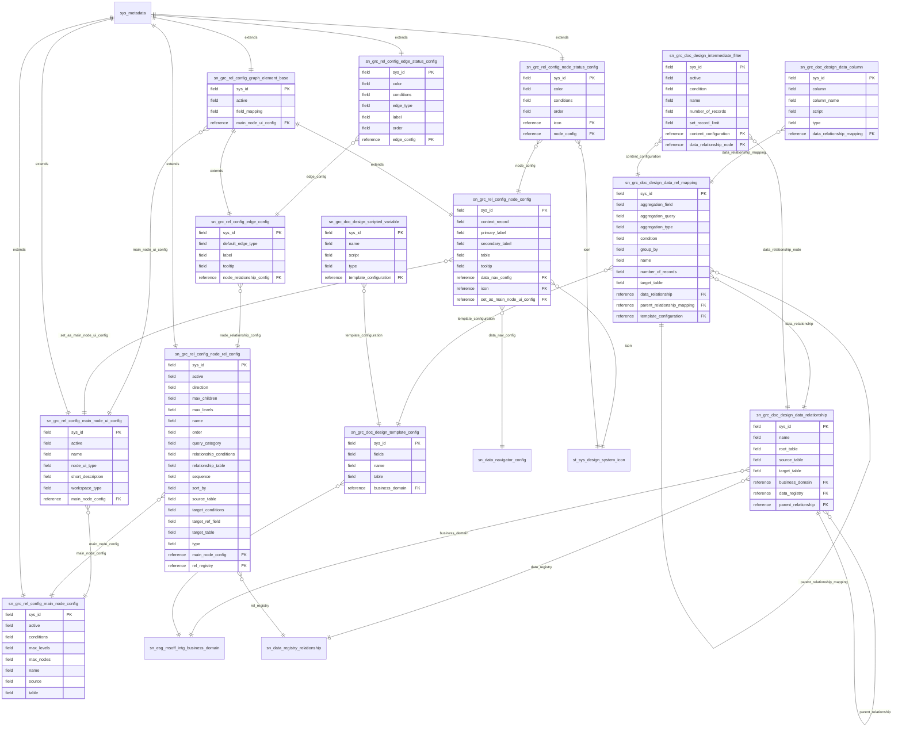

# Schema ERD: doc-designer

Instance: `alectri`  |  scopes: sn_grc_doc_design, sn_grc_rel_config
Discovered: 2026-06-08T16:20:11.395757+00:00

## Cross-scope bridges

- sn_grc_doc_design_data_relationship.business_domain -> sn_esg_msoff_intg_business_domain
- sn_grc_doc_design_data_relationship.data_registry -> sn_data_registry_relationship
- sn_grc_doc_design_template_config.business_domain -> sn_esg_msoff_intg_business_domain
- sn_grc_rel_config_node_config.data_nav_config -> sn_data_navigator_config
- sn_grc_rel_config_node_config.icon -> st_sys_design_system_icon
- sn_grc_rel_config_node_rel_config.rel_registry -> sn_data_registry_relationship
- sn_grc_rel_config_node_status_config.icon -> st_sys_design_system_icon

## Fields

### sn_grc_doc_design_data_column -- Data column

| Field | Type | References |
| --- | --- | --- |
| column | field |  |
| column_name | field |  |
| data_relationship_mapping | reference | sn_grc_doc_design_data_rel_mapping |
| script | field |  |
| sys_created_by | field |  |
| sys_created_on | field |  |
| sys_domain | field |  |
| sys_domain_path | field |  |
| sys_id | field |  |
| sys_mod_count | field |  |
| sys_updated_by | field |  |
| sys_updated_on | field |  |
| type | field |  |

### sn_grc_doc_design_data_rel_mapping -- Content configuration

| Field | Type | References |
| --- | --- | --- |
| aggregation_field | field |  |
| aggregation_query | field |  |
| aggregation_type | field |  |
| condition | field |  |
| data_relationship | reference | sn_grc_doc_design_data_relationship |
| group_by | field |  |
| name | field |  |
| number_of_records | field |  |
| parent_relationship_mapping | reference | sn_grc_doc_design_data_rel_mapping |
| sys_created_by | field |  |
| sys_created_on | field |  |
| sys_domain | field |  |
| sys_domain_path | field |  |
| sys_id | field |  |
| sys_mod_count | field |  |
| sys_updated_by | field |  |
| sys_updated_on | field |  |
| target_table | field |  |
| template_configuration | reference | sn_grc_doc_design_template_config |

### sn_grc_doc_design_data_relationship -- Data relationship

| Field | Type | References |
| --- | --- | --- |
| business_domain | reference | sn_esg_msoff_intg_business_domain |
| data_registry | reference | sn_data_registry_relationship |
| name | field |  |
| parent_relationship | reference | sn_grc_doc_design_data_relationship |
| root_table | field |  |
| source_table | field |  |
| sys_created_by | field |  |
| sys_created_on | field |  |
| sys_domain | field |  |
| sys_domain_path | field |  |
| sys_id | field |  |
| sys_mod_count | field |  |
| sys_updated_by | field |  |
| sys_updated_on | field |  |
| target_table | field |  |

### sn_grc_doc_design_intermediate_filter -- Intermediate filter

| Field | Type | References |
| --- | --- | --- |
| active | field |  |
| condition | field |  |
| content_configuration | reference | sn_grc_doc_design_data_rel_mapping |
| data_relationship_node | reference | sn_grc_doc_design_data_relationship |
| name | field |  |
| number_of_records | field |  |
| set_record_limit | field |  |
| sys_created_by | field |  |
| sys_created_on | field |  |
| sys_domain | field |  |
| sys_domain_path | field |  |
| sys_id | field |  |
| sys_mod_count | field |  |
| sys_updated_by | field |  |
| sys_updated_on | field |  |

### sn_grc_doc_design_scripted_variable -- Scripted variable

| Field | Type | References |
| --- | --- | --- |
| name | field |  |
| script | field |  |
| sys_created_by | field |  |
| sys_created_on | field |  |
| sys_domain | field |  |
| sys_domain_path | field |  |
| sys_id | field |  |
| sys_mod_count | field |  |
| sys_updated_by | field |  |
| sys_updated_on | field |  |
| template_configuration | reference | sn_grc_doc_design_template_config |
| type | field |  |

### sn_grc_doc_design_template_config -- Template configuration

| Field | Type | References |
| --- | --- | --- |
| business_domain | reference | sn_esg_msoff_intg_business_domain |
| fields | field |  |
| name | field |  |
| sys_created_by | field |  |
| sys_created_on | field |  |
| sys_domain | field |  |
| sys_domain_path | field |  |
| sys_id | field |  |
| sys_mod_count | field |  |
| sys_updated_by | field |  |
| sys_updated_on | field |  |
| table | field |  |

### sn_grc_rel_config_edge_config -- Connector configuration

| Field | Type | References |
| --- | --- | --- |
| default_edge_type | field |  |
| label | field |  |
| node_relationship_config | reference | sn_grc_rel_config_node_rel_config |
| sys_id | field |  |
| tooltip | field |  |

### sn_grc_rel_config_edge_status_config -- Connector status configuration

| Field | Type | References |
| --- | --- | --- |
| color | field |  |
| conditions | field |  |
| edge_config | reference | sn_grc_rel_config_edge_config |
| edge_type | field |  |
| label | field |  |
| order | field |  |
| sys_domain | field |  |
| sys_domain_path | field |  |
| sys_id | field |  |

### sn_grc_rel_config_graph_element_base -- Graph element base configuration

| Field | Type | References |
| --- | --- | --- |
| active | field |  |
| field_mapping | field |  |
| main_node_ui_config | reference | sn_grc_rel_config_main_node_ui_config |
| sys_domain | field |  |
| sys_domain_path | field |  |
| sys_id | field |  |

### sn_grc_rel_config_main_node_config -- Main node configuration

| Field | Type | References |
| --- | --- | --- |
| active | field |  |
| conditions | field |  |
| max_levels | field |  |
| max_nodes | field |  |
| name | field |  |
| source | field |  |
| sys_domain | field |  |
| sys_domain_path | field |  |
| sys_id | field |  |
| table | field |  |

### sn_grc_rel_config_main_node_ui_config -- Nexus map configuration

| Field | Type | References |
| --- | --- | --- |
| active | field |  |
| main_node_config | reference | sn_grc_rel_config_main_node_config |
| name | field |  |
| node_ui_type | field |  |
| short_description | field |  |
| sys_domain | field |  |
| sys_domain_path | field |  |
| sys_id | field |  |
| workspace_type | field |  |

### sn_grc_rel_config_node_config -- Node configuration

| Field | Type | References |
| --- | --- | --- |
| context_record | field |  |
| data_nav_config | reference | sn_data_navigator_config |
| icon | reference | st_sys_design_system_icon |
| primary_label | field |  |
| secondary_label | field |  |
| set_as_main_node_ui_config | reference | sn_grc_rel_config_main_node_ui_config |
| sys_id | field |  |
| table | field |  |
| tooltip | field |  |

### sn_grc_rel_config_node_rel_config -- Node relationship configuration

| Field | Type | References |
| --- | --- | --- |
| active | field |  |
| direction | field |  |
| main_node_config | reference | sn_grc_rel_config_main_node_config |
| max_children | field |  |
| max_levels | field |  |
| name | field |  |
| order | field |  |
| query_category | field |  |
| rel_registry | reference | sn_data_registry_relationship |
| relationship_conditions | field |  |
| relationship_table | field |  |
| sequence | field |  |
| sort_by | field |  |
| source_table | field |  |
| sys_domain | field |  |
| sys_domain_path | field |  |
| sys_id | field |  |
| target_conditions | field |  |
| target_ref_field | field |  |
| target_table | field |  |
| type | field |  |

### sn_grc_rel_config_node_status_config -- Node status configuration

| Field | Type | References |
| --- | --- | --- |
| color | field |  |
| conditions | field |  |
| icon | reference | st_sys_design_system_icon |
| node_config | reference | sn_grc_rel_config_node_config |
| order | field |  |
| sys_domain | field |  |
| sys_domain_path | field |  |
| sys_id | field |  |
