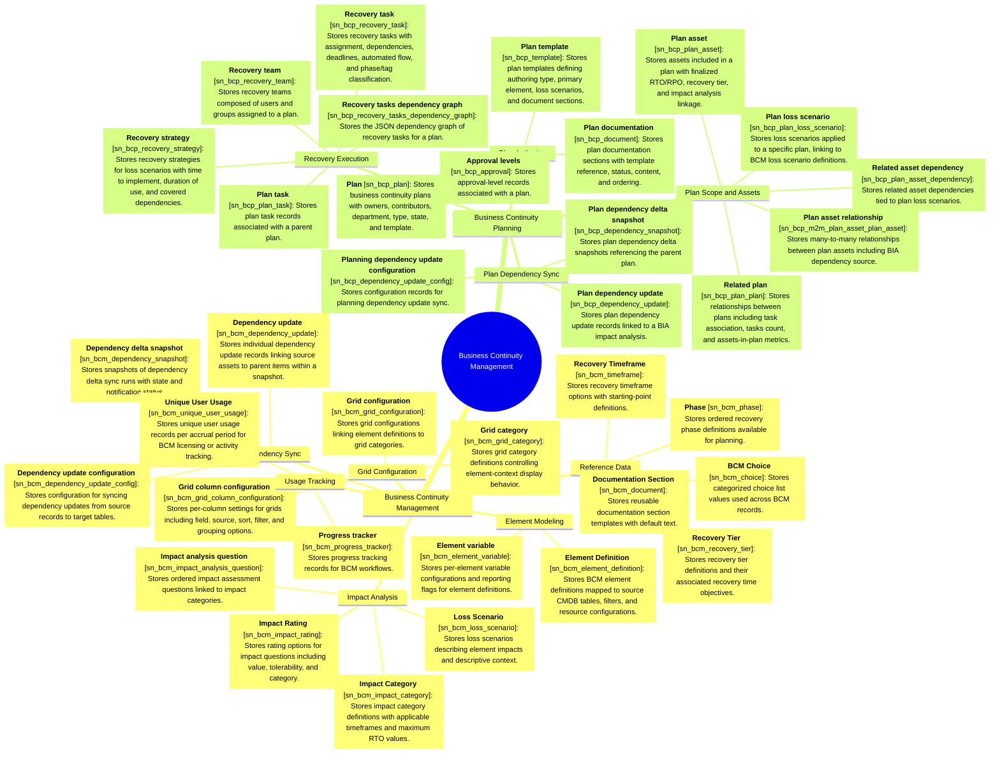

# Schema mindmap: bcm

Instance: `alectri`  |  generated: 2026-06-09T17:11:46.651443+00:00

## Business Continuity Management

### Reference Data

- **BCM Choice** [sn_bcm_choice]: Stores categorized choice list values used across BCM records.
- **Phase** [sn_bcm_phase]: Stores ordered recovery phase definitions available for planning.
- **Recovery Timeframe** [sn_bcm_timeframe]: Stores recovery timeframe options with starting-point definitions.
- **Recovery Tier** [sn_bcm_recovery_tier]: Stores recovery tier definitions and their associated recovery time objectives.
- **Documentation Section** [sn_bcm_document]: Stores reusable documentation section templates with default text.

### Element Modeling

- **Element Definition** [sn_bcm_element_definition]: Stores BCM element definitions mapped to source CMDB tables, filters, and resource configurations.
- **Element variable** [sn_bcm_element_variable]: Stores per-element variable configurations and reporting flags for element definitions.

### Impact Analysis

- **Impact Category** [sn_bcm_impact_category]: Stores impact category definitions with applicable timeframes and maximum RTO values.
- **Impact analysis question** [sn_bcm_impact_analysis_question]: Stores ordered impact assessment questions linked to impact categories.
- **Impact Rating** [sn_bcm_impact_rating]: Stores rating options for impact questions including value, tolerability, and category.
- **Loss Scenario** [sn_bcm_loss_scenario]: Stores loss scenarios describing element impacts and descriptive context.

### Grid Configuration

- **Grid category** [sn_bcm_grid_category]: Stores grid category definitions controlling element-context display behavior.
- **Grid configuration** [sn_bcm_grid_configuration]: Stores grid configurations linking element definitions to grid categories.
- **Grid column configuration** [sn_bcm_grid_column_configuration]: Stores per-column settings for grids including field, source, sort, filter, and grouping options.

### Dependency Sync

- **Dependency update configuration** [sn_bcm_dependency_update_config]: Stores configuration for syncing dependency updates from source records to target tables.
- **Dependency delta snapshot** [sn_bcm_dependency_snapshot]: Stores snapshots of dependency delta sync runs with state and notification status.
- **Dependency update** [sn_bcm_dependency_update]: Stores individual dependency update records linking source assets to parent items within a snapshot.

### Usage Tracking

- **Unique User Usage** [sn_bcm_unique_user_usage]: Stores unique user usage records per accrual period for BCM licensing or activity tracking.
- **Progress tracker** [sn_bcm_progress_tracker]: Stores progress tracking records for BCM workflows.

## Business Continuity Planning

### Plan Authoring

- **Plan** [sn_bcp_plan]: Stores business continuity plans with owners, contributors, department, type, state, and template.
- **Plan template** [sn_bcp_template]: Stores plan templates defining authoring type, primary element, loss scenarios, and document sections.
- **Plan documentation** [sn_bcp_document]: Stores plan documentation sections with template reference, status, content, and ordering.
- **Approval levels** [sn_bcp_approval]: Stores approval-level records associated with a plan.

### Plan Scope and Assets

- **Plan asset** [sn_bcp_plan_asset]: Stores assets included in a plan with finalized RTO/RPO, recovery tier, and impact analysis linkage.
- **Plan asset relationship** [sn_bcp_m2m_plan_asset_plan_asset]: Stores many-to-many relationships between plan assets including BIA dependency source.
- **Related asset dependency** [sn_bcp_plan_asset_dependency]: Stores related asset dependencies tied to plan loss scenarios.
- **Plan loss scenario** [sn_bcp_plan_loss_scenario]: Stores loss scenarios applied to a specific plan, linking to BCM loss scenario definitions.
- **Related plan** [sn_bcp_plan_plan]: Stores relationships between plans including task association, tasks count, and assets-in-plan metrics.

### Plan Dependency Sync

- **Planning dependency update configuration** [sn_bcp_dependency_update_config]: Stores configuration records for planning dependency update sync.
- **Plan dependency delta snapshot** [sn_bcp_dependency_snapshot]: Stores plan dependency delta snapshots referencing the parent plan.
- **Plan dependency update** [sn_bcp_dependency_update]: Stores plan dependency update records linked to a BIA impact analysis.

### Recovery Execution

- **Recovery strategy** [sn_bcp_recovery_strategy]: Stores recovery strategies for loss scenarios with time to implement, duration of use, and covered dependencies.
- **Recovery team** [sn_bcp_recovery_team]: Stores recovery teams composed of users and groups assigned to a plan.
- **Recovery task** [sn_bcp_recovery_task]: Stores recovery tasks with assignment, dependencies, deadlines, automated flow, and phase/tag classification.
- **Plan task** [sn_bcp_plan_task]: Stores plan task records associated with a parent plan.
- **Recovery tasks dependency graph** [sn_bcp_recovery_tasks_dependency_graph]: Stores the JSON dependency graph of recovery tasks for a plan.
