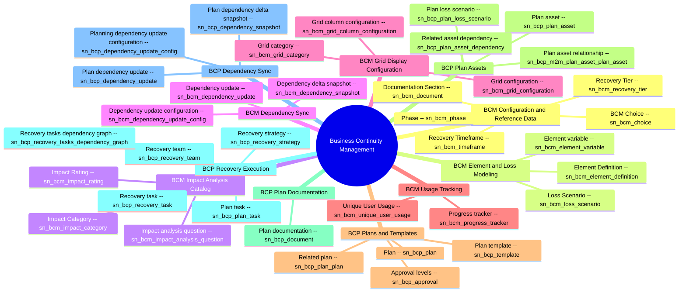

# Schema mindmap: bcm

Instance: `alectri`  |  generated: 2026-06-08T23:00:54.386845+00:00

## BCM Configuration and Reference Data

- **BCM Choice** [sn_bcm_choice]: Stores reusable choice values categorized for use across BCM records.
- **Phase** [sn_bcm_phase]: Stores ordered named phases used to sequence BCM activities.
- **Recovery Timeframe** [sn_bcm_timeframe]: Stores named recovery timeframes with a starts-at value used for RTO/RPO references.
- **Recovery Tier** [sn_bcm_recovery_tier]: Stores recovery tiers grouping one or more recovery time objective timeframes.
- **Documentation Section** [sn_bcm_document]: Stores documentation section definitions with title, description, and default text.

## BCM Element and Loss Modeling

- **Element Definition** [sn_bcm_element_definition]: Stores definitions of assessable elements with source table, filter, fields, and resource configuration linkage.
- **Element variable** [sn_bcm_element_variable]: Stores per-element variables flagged for reporting against an element definition.
- **Loss Scenario** [sn_bcm_loss_scenario]: Stores named loss scenarios describing impacted elements and their description.

## BCM Impact Analysis Catalog

- **Impact Category** [sn_bcm_impact_category]: Stores impact categories with helper text, applicable timeframes, contribution, and maximum RTO.
- **Impact analysis question** [sn_bcm_impact_analysis_question]: Stores ordered impact analysis questions linked to an impact category.
- **Impact Rating** [sn_bcm_impact_rating]: Stores rating values and question text tying an impact analysis question to an impact category with tolerability.

## BCM Dependency Sync

- **Dependency update configuration** [sn_bcm_dependency_update_config]: Stores configurations defining target tables, sources, filters, and field templates for auto-updating dependencies.
- **Dependency delta snapshot** [sn_bcm_dependency_snapshot]: Stores numbered dependency delta snapshots with state, notification status, sync timestamp, and user lists.
- **Dependency update** [sn_bcm_dependency_update]: Stores individual dependency update records linking parent and asset items with relationship source and additional data.

## BCM Grid Display Configuration

- **Grid category** [sn_bcm_grid_category]: Stores grid categories with code and element-context flag used to classify grids.
- **Grid configuration** [sn_bcm_grid_configuration]: Stores grid configurations linking a grid category to an element definition with active flag.
- **Grid column configuration** [sn_bcm_grid_column_configuration]: Stores per-grid column definitions including field source, sort/filter/group flags, and order.

## BCM Usage Tracking

- **Unique User Usage** [sn_bcm_unique_user_usage]: Stores unique user usage records per accrual period for BCM consumption tracking.
- **Progress tracker** [sn_bcm_progress_tracker]: Stores progress tracker records identified by sys_id.

## BCP Plans and Templates

- **Plan template** [sn_bcp_template]: Stores plan templates defining authoring type, group-by, loss scenarios, document sections, and primary element recovered.
- **Plan** [sn_bcp_plan]: Stores business continuity plans with owner, lead, contributors, department, business unit, state, expiry, and template.
- **Related plan** [sn_bcp_plan_plan]: Stores relationships between a plan and a related plan including relationship type, source, tasks count, and assets.
- **Approval levels** [sn_bcp_approval]: Stores approval level records associated with a plan.

## BCP Plan Assets

- **Plan asset** [sn_bcp_plan_asset]: Stores plan assets referencing an item with element definition, recovery tier, finalized RTO/RPO, achievable recovery time, and impact analysis.
- **Plan asset relationship** [sn_bcp_m2m_plan_asset_plan_asset]: Stores many-to-many relationships between primary and related plan assets with BIA dependency and source.
- **Related asset dependency** [sn_bcp_plan_asset_dependency]: Stores asset dependency items tied to a plan loss scenario with item and item table.
- **Plan loss scenario** [sn_bcp_plan_loss_scenario]: Stores plan-scoped instances of loss scenarios linking a plan to a BCM loss scenario.

## BCP Plan Documentation

- **Plan documentation** [sn_bcp_document]: Stores plan documentation entries with title, contents, template, status, and order tied to a plan.

## BCP Recovery Execution

- **Recovery strategy** [sn_bcp_recovery_strategy]: Stores recovery strategies covering plan loss scenarios with time-to-implement, duration of use, and operations-achieved estimates.
- **Recovery team** [sn_bcp_recovery_team]: Stores recovery teams composed of users and groups assigned to a plan.
- **Recovery task** [sn_bcp_recovery_task]: Stores recovery tasks with phase, scope, assignment, dependencies, deadlines, automated flow, recovery team, and configuration item linkage.
- **Recovery tasks dependency graph** [sn_bcp_recovery_tasks_dependency_graph]: Stores JSON dependency graphs of recovery tasks per plan.
- **Plan task** [sn_bcp_plan_task]: Stores plan task records linked to a plan.

## BCP Dependency Sync

- **Planning dependency update configuration** [sn_bcp_dependency_update_config]: Stores planning dependency update configuration records identified by sys_id.
- **Plan dependency delta snapshot** [sn_bcp_dependency_snapshot]: Stores plan-scoped dependency delta snapshots referencing the owning plan.
- **Plan dependency update** [sn_bcp_dependency_update]: Stores plan dependency update records linked to an impact analysis.
