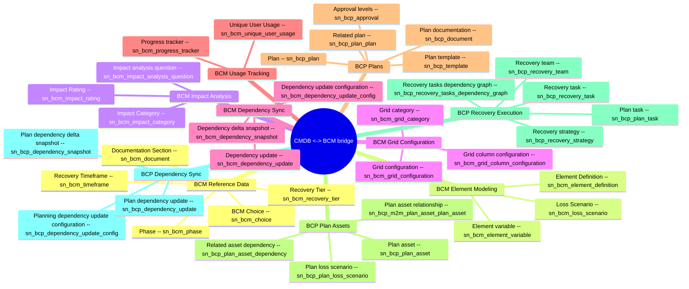

# Schema mindmap: cmdb-bcm

Instance: `alectri`  |  generated: 2026-06-08T23:03:17.966846+00:00

## BCM Reference Data

- **BCM Choice** [sn_bcm_choice]: Stores reusable BCM choice values categorized for dropdowns and tagging across the BCM scope.
- **Phase** [sn_bcm_phase]: Stores ordered recovery/lifecycle phases used to sequence BCM activities.
- **Recovery Timeframe** [sn_bcm_timeframe]: Stores named recovery timeframe values with a starting-point used for RTO/RPO references.
- **Recovery Tier** [sn_bcm_recovery_tier]: Stores recovery tier definitions that group acceptable recovery time objectives.
- **Documentation Section** [sn_bcm_document]: Stores reusable documentation section templates with default text for BCM/BCP documents.

## BCM Element Modeling

- **Element Definition** [sn_bcm_element_definition]: Stores element type definitions including source table, field selection, filter, and backup requirement for assessable items.
- **Element variable** [sn_bcm_element_variable]: Stores element-level variables linked to an element definition with reporting flag.
- **Loss Scenario** [sn_bcm_loss_scenario]: Stores loss scenarios and the element definitions they impact.

## BCM Impact Analysis

- **Impact Category** [sn_bcm_impact_category]: Stores impact categories with helper text, applicable timeframes, and maximum RTO value.
- **Impact analysis question** [sn_bcm_impact_analysis_question]: Stores ordered impact analysis questions grouped by impact category.
- **Impact Rating** [sn_bcm_impact_rating]: Stores rating options for impact analysis questions with values and tolerability flag.

## BCM Grid Configuration

- **Grid category** [sn_bcm_grid_category]: Stores grid categories with codes that drive element-context grids.
- **Grid configuration** [sn_bcm_grid_configuration]: Stores grid configurations linking a grid category and element definition.
- **Grid column configuration** [sn_bcm_grid_column_configuration]: Stores per-column configuration for a grid including field, source table, sort/filter/group flags, and order.

## BCM Dependency Sync

- **Dependency update configuration** [sn_bcm_dependency_update_config]: Stores configuration that drives auto-update of dependency fields on a target table from defined sources.
- **Dependency delta snapshot** [sn_bcm_dependency_snapshot]: Stores delta snapshots of dependency updates with sync timestamp, state, and notification status.
- **Dependency update** [sn_bcm_dependency_update]: Stores individual dependency update records linking parent and asset items to a snapshot with source metadata.

## BCM Usage Tracking

- **Unique User Usage** [sn_bcm_unique_user_usage]: Stores unique-user usage records per accrual period for BCM licensing/metering.
- **Progress tracker** [sn_bcm_progress_tracker]: Stores progress tracker records keyed by sys_id.

## BCP Plans

- **Plan** [sn_bcp_plan]: Stores business continuity plans with owner, lead, department, business unit, template, state, and expiration.
- **Plan template** [sn_bcp_template]: Stores plan templates defining authoring type, primary element recovered, loss scenarios, and document sections.
- **Approval levels** [sn_bcp_approval]: Stores approval-level records associated with a plan.
- **Related plan** [sn_bcp_plan_plan]: Stores related-plan associations with relationship type and task/asset counts.
- **Plan documentation** [sn_bcp_document]: Stores plan documentation sections with contents, status, and reference to a document template.

## BCP Plan Assets

- **Plan asset** [sn_bcp_plan_asset]: Stores assets included in a plan with element definition, finalized RTO/RPO, recovery tier, achievable RTO, and source status.
- **Plan asset relationship** [sn_bcp_m2m_plan_asset_plan_asset]: Stores many-to-many relationships between primary and related plan assets with BIA dependency source.
- **Related asset dependency** [sn_bcp_plan_asset_dependency]: Stores dependencies between a plan asset and items tied to a plan loss scenario.
- **Plan loss scenario** [sn_bcp_plan_loss_scenario]: Stores plan-specific instances of loss scenarios referencing the BCM loss scenario catalog.

## BCP Recovery Execution

- **Recovery strategy** [sn_bcp_recovery_strategy]: Stores recovery strategies for a plan loss scenario with time-to-implement, duration-of-use, and covered dependencies.
- **Recovery task** [sn_bcp_recovery_task]: Stores recovery tasks with phase, assignment, dependencies, configuration item, automated flow, planned duration, and documentation.
- **Recovery tasks dependency graph** [sn_bcp_recovery_tasks_dependency_graph]: Stores a JSON dependency graph of recovery tasks for a given plan.
- **Recovery team** [sn_bcp_recovery_team]: Stores recovery teams composed of users and groups assigned to a plan.
- **Plan task** [sn_bcp_plan_task]: Stores plan task records linking tasks to a plan.

## BCP Dependency Sync

- **Planning dependency update configuration** [sn_bcp_dependency_update_config]: Stores planning dependency update configuration records.
- **Plan dependency delta snapshot** [sn_bcp_dependency_snapshot]: Stores plan-scoped dependency delta snapshots keyed to a plan.
- **Plan dependency update** [sn_bcp_dependency_update]: Stores plan dependency update records tied to an impact analysis.
