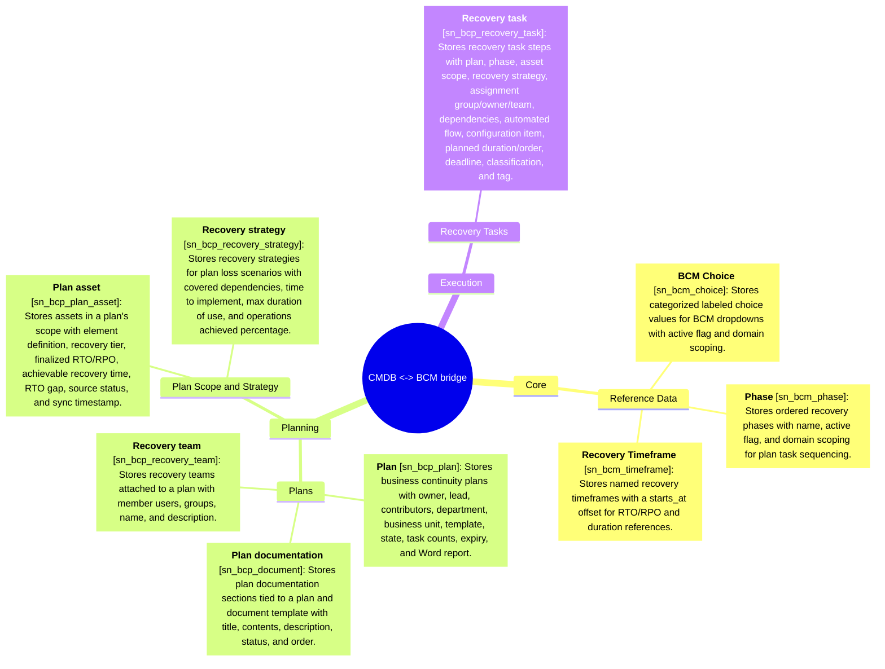

# Schema mindmap: cmdb-bcm

Instance: `alectri`  |  generated: 2026-06-09T17:12:44.673775+00:00

## Core

### Reference Data

- **BCM Choice** [sn_bcm_choice]: Stores categorized labeled choice values for BCM dropdowns with active flag and domain scoping.
- **Phase** [sn_bcm_phase]: Stores ordered recovery phases with name, active flag, and domain scoping for plan task sequencing.
- **Recovery Timeframe** [sn_bcm_timeframe]: Stores named recovery timeframes with a starts_at offset for RTO/RPO and duration references.

## Planning

### Plans

- **Plan** [sn_bcp_plan]: Stores business continuity plans with owner, lead, contributors, department, business unit, template, state, task counts, expiry, and Word report.
- **Plan documentation** [sn_bcp_document]: Stores plan documentation sections tied to a plan and document template with title, contents, description, status, and order.
- **Recovery team** [sn_bcp_recovery_team]: Stores recovery teams attached to a plan with member users, groups, name, and description.

### Plan Scope and Strategy

- **Plan asset** [sn_bcp_plan_asset]: Stores assets in a plan's scope with element definition, recovery tier, finalized RTO/RPO, achievable recovery time, RTO gap, source status, and sync timestamp.
- **Recovery strategy** [sn_bcp_recovery_strategy]: Stores recovery strategies for plan loss scenarios with covered dependencies, time to implement, max duration of use, and operations achieved percentage.

## Execution

### Recovery Tasks

- **Recovery task** [sn_bcp_recovery_task]: Stores recovery task steps with plan, phase, asset scope, recovery strategy, assignment group/owner/team, dependencies, automated flow, configuration item, planned duration/order, deadline, classification, and tag.
