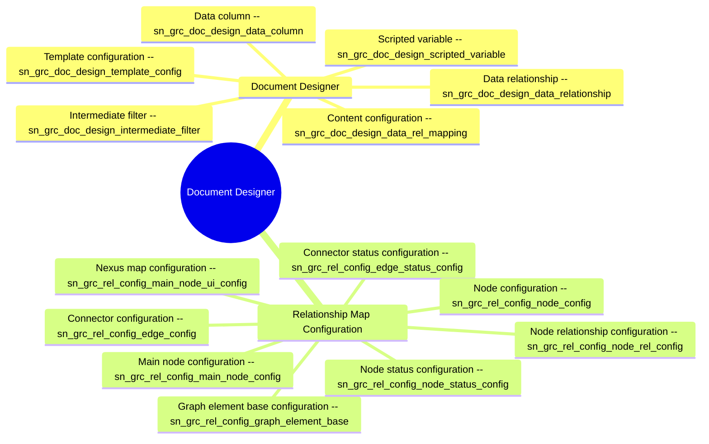

# Schema mindmap: doc-designer

Instance: `alectri`  |  generated: 2026-06-08T23:02:10.357532+00:00

## Document Designer

- **Data column** [sn_grc_doc_design_data_column]: Stores field-level column definitions mapped to content configurations, with column name, type, and optional script for Word template population.
- **Content configuration** [sn_grc_doc_design_data_rel_mapping]: Stores content configuration records linking a template configuration to a data relationship, with target table, aggregation, grouping, conditions, and record limits.
- **Data relationship** [sn_grc_doc_design_data_relationship]: Stores data relationship definitions between source and target tables, referencing the data registry relationship, parent relationship, root table, and business domain.
- **Intermediate filter** [sn_grc_doc_design_intermediate_filter]: Stores intermediate filter records applied to data relationship nodes within a content configuration, with conditions and record limits.
- **Scripted variable** [sn_grc_doc_design_scripted_variable]: Stores scripted variables (name, type, script) attached to a template configuration for use in generated documents.
- **Template configuration** [sn_grc_doc_design_template_config]: Stores Word template configurations tied to a source table, fields list, and business domain for document generation.

## Relationship Map Configuration

- **Connector configuration** [sn_grc_rel_config_edge_config]: Stores connector (edge) configurations including default connector type, label, tooltip, and the linked node relationship configuration.
- **Connector status configuration** [sn_grc_rel_config_edge_status_config]: Stores status-based styling for connectors, including color, label, type, conditions, and order, scoped to a connector configuration.
- **Graph element base configuration** [sn_grc_rel_config_graph_element_base]: Stores base graph element configuration linking field mappings to a Nexus map configuration with an active flag.
- **Main node configuration** [sn_grc_rel_config_main_node_config]: Stores main node configuration with source table, conditions, and limits on maximum nodes and hierarchy levels for the relationship map.
- **Nexus map configuration** [sn_grc_rel_config_main_node_ui_config]: Stores Nexus map UI configurations linking a main node configuration to a workspace type and node UI rendering type.
- **Node configuration** [sn_grc_rel_config_node_config]: Stores node display configurations including primary/secondary labels, icon, tooltip, context record, table, and 360-degree view configuration.
- **Node relationship configuration** [sn_grc_rel_config_node_rel_config]: Stores node relationship configurations defining traversal between source and target tables via a relationship registry, with direction, sorting, conditions, and child/level limits.
- **Node status configuration** [sn_grc_rel_config_node_status_config]: Stores status-based styling for nodes, including color, icon, conditions, and order, scoped to a node configuration.
