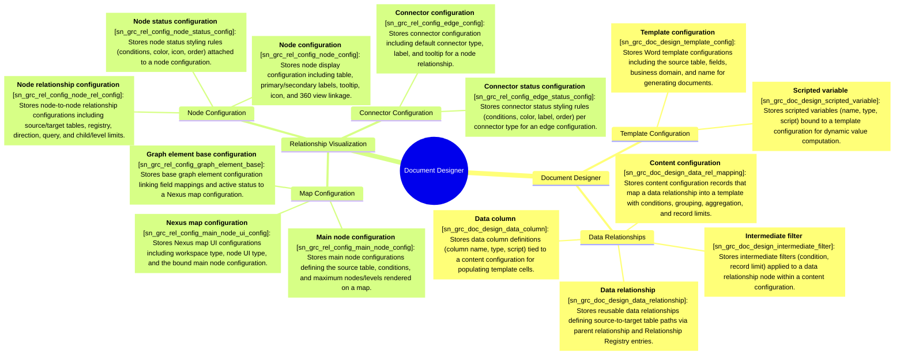

# Schema mindmap: doc-designer

Instance: `alectri`  |  generated: 2026-06-09T17:10:33.288276+00:00

## Document Designer

### Template Configuration

- **Template configuration** [sn_grc_doc_design_template_config]: Stores Word template configurations including the source table, fields, business domain, and name for generating documents.
- **Scripted variable** [sn_grc_doc_design_scripted_variable]: Stores scripted variables (name, type, script) bound to a template configuration for dynamic value computation.

### Data Relationships

- **Data relationship** [sn_grc_doc_design_data_relationship]: Stores reusable data relationships defining source-to-target table paths via parent relationship and Relationship Registry entries.
- **Content configuration** [sn_grc_doc_design_data_rel_mapping]: Stores content configuration records that map a data relationship into a template with conditions, grouping, aggregation, and record limits.
- **Intermediate filter** [sn_grc_doc_design_intermediate_filter]: Stores intermediate filters (condition, record limit) applied to a data relationship node within a content configuration.
- **Data column** [sn_grc_doc_design_data_column]: Stores data column definitions (column name, type, script) tied to a content configuration for populating template cells.

## Relationship Visualization

### Map Configuration

- **Nexus map configuration** [sn_grc_rel_config_main_node_ui_config]: Stores Nexus map UI configurations including workspace type, node UI type, and the bound main node configuration.
- **Main node configuration** [sn_grc_rel_config_main_node_config]: Stores main node configurations defining the source table, conditions, and maximum nodes/levels rendered on a map.
- **Graph element base configuration** [sn_grc_rel_config_graph_element_base]: Stores base graph element configuration linking field mappings and active status to a Nexus map configuration.

### Node Configuration

- **Node configuration** [sn_grc_rel_config_node_config]: Stores node display configuration including table, primary/secondary labels, tooltip, icon, and 360 view linkage.
- **Node status configuration** [sn_grc_rel_config_node_status_config]: Stores node status styling rules (conditions, color, icon, order) attached to a node configuration.
- **Node relationship configuration** [sn_grc_rel_config_node_rel_config]: Stores node-to-node relationship configurations including source/target tables, registry, direction, query, and child/level limits.

### Connector Configuration

- **Connector configuration** [sn_grc_rel_config_edge_config]: Stores connector configuration including default connector type, label, and tooltip for a node relationship.
- **Connector status configuration** [sn_grc_rel_config_edge_status_config]: Stores connector status styling rules (conditions, color, label, order) per connector type for an edge configuration.
